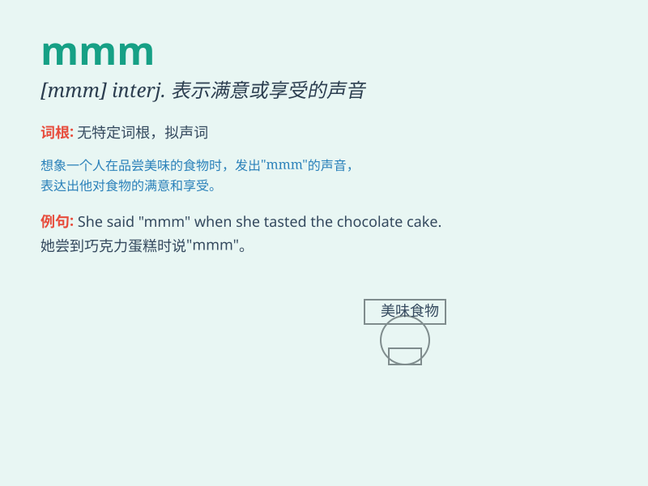

## mmm

**英音:** _null_ **美音:** _null_

**译义:** *int.嗯;Mobil Media Mode,移动媒体模式*

### 短语

+ **mmm delicious:** _嗯，美味_

+ **mmm interesting:** _嗯，有趣_

+ **mmm wonderful:** _嗯，精彩_

+ **mmm amazing:** _嗯，令人惊奇_

+ **mmm good:** _嗯，好_

### 例句

#### 例句1

> **Mmm, this cake is delicious.**

**中文翻译:** 嗯，这个蛋糕很美味。

**单词释义:** 表示发出享受美食时的声音，意为'嗯'

#### 例句2

> **Mmm, I think I need a break.**

**中文翻译:** 嗯，我想我需要休息一下。

**单词释义:** 表示思考或犹豫时的声音，意为'嗯'

#### 例句3

> **Mmm, that\'s an interesting idea.**

**中文翻译:** 嗯，那是个有趣的想法。

**单词释义:** 表示对某事感兴趣或表示认可的声音，意为'嗯'

### 背诵小故事

> One day, a little boy was trying to imitate the sound of a bee. He
kept saying \'mmm\' to represent the buzzing. Later, he realized that
\'mmm\' also sounded like the hum of a machine.

**有一天，一个小男孩试图模仿蜜蜂的声音。他一直说"mmm"来代表嗡嗡声。后来，他意识到"mmm"听起来也像机器的嗡嗡声。**

### 图义

