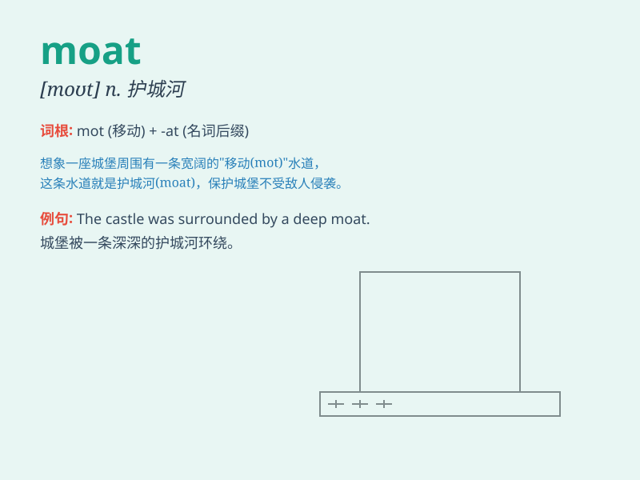

## moat

**英音:** _[məʊt]_ **美音:** _[mot]_

**译义:** *n.护城河,城壕v.挖壕围绕*

### 短语

+ **castle moat:** _城堡的护城河_

+ **moat around:** _环绕着护城河_

+ **wide moat:** _宽阔的护城河_

+ **deep moat:** _深的护城河_

+ **fill the moat:** _填满护城河_

### 例句

#### 例句1

> **The castle was surrounded by a deep moat.**

**中文翻译:** 这座城堡被一条深深的护城河环绕着。

**单词释义:** 护城河

#### 例句2

> **The enemy had to cross the moat to attack the city.**

**中文翻译:** 敌人必须穿过护城河才能攻击这座城市。

**单词释义:** 护城河

#### 例句3

> **The moat was filled with water to prevent invaders.**

**中文翻译:** 护城河灌满了水以阻止侵略者。

**单词释义:** 护城河

### 背诵小故事

> A brave knight wanted to enter the castle. But there was a deep moat
around it. The water in the moat was wide and dangerous. It was a big
challenge for the knight to cross it and reach the castle.

**一位勇敢的骑士想要进入城堡。但是城堡周围有一条很深的护城河。护城河里的水又宽又危险。对于骑士来说，跨越它并到达城堡是一个巨大的挑战。**

### 图义

