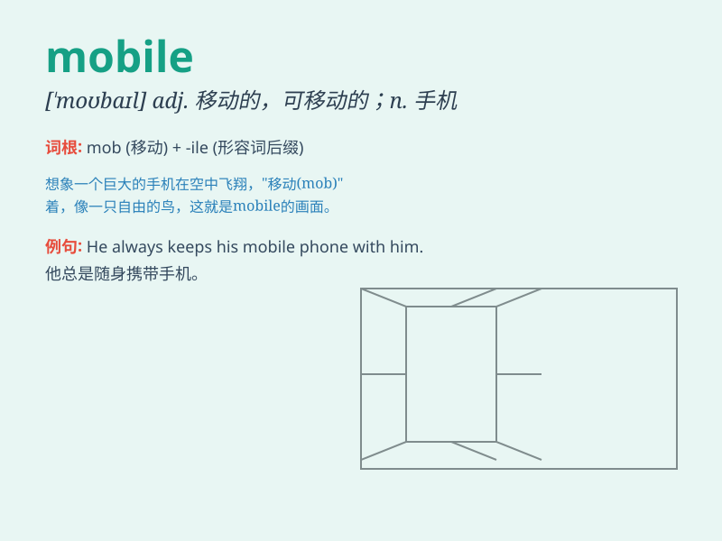

## mobile

**英音:** _[ˈməʊbaɪl]_ **美音:** _[ˈmobəl]_

**译义:** *adj.可移动的,易变的,机动的n.运动物体*

### 短语

+ **mobile phone:** _移动电话；手机_

+ **mobile device:** _移动设备_

+ **mobile communication:** _移动通信_

+ **mobile library:** _流动图书馆_

+ **mobile home:** _可移动房屋_

### 例句

#### 例句1

> **He has a mobile phone.**

**中文翻译:** 他有一部手机。

**单词释义:** 移动的；可移动的

#### 例句2

> **The mobile library visits our town every month.**

**中文翻译:** 流动图书馆每月来我们镇一次。

**单词释义:** 流动的；移动的

#### 例句3

> **She is a very mobile baby.**

**中文翻译:** 她是个好动的宝宝。

**单词释义:** 好动的；活动的

### 背诵小故事

> A mobile phone was lost in a moving car. The owner was very worried.
But luckily, it was found because the phone had a special mobile strap.
So, remember, \'mobile\' means able to move freely.

**一部手机在一辆行驶的汽车里丢了。主人非常担心。但幸运的是，它被找到了，因为手机有一个特别的活动挂绳。所以，记住，\'mobile\'意思是可移动的，活动的。**

### 图义

