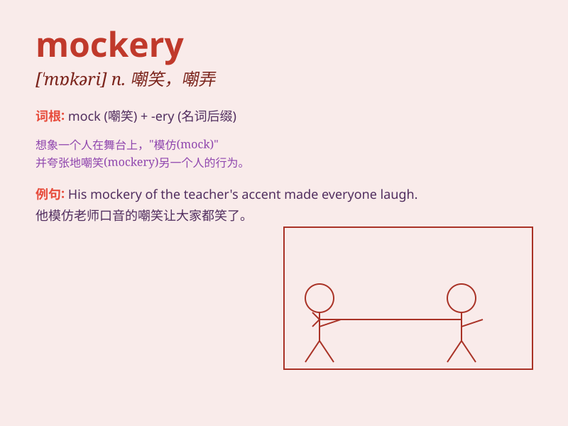

## mockery

**英音:** _[\'mɒk(ə)rɪ]_ **美音:** _[\'mɑkəri]_

**译义:** *n.嘲笑*

### 短语

+ **make a mockery of:** _嘲弄；糟蹋；使...成为笑柄_

+ **in mockery:** _以嘲笑；出于嘲弄_

+ **mockery laughter:** _嘲笑的笑声_

+ **subject to mockery:** _遭受嘲笑_

+ **turn into mockery:** _变成嘲笑_

### 例句

#### 例句1

> **His attempt at singing was met with mockery from the
audience.**

**中文翻译:** 他的歌唱尝试遭到了观众的嘲笑。

**单词释义:** 嘲笑；愚弄

#### 例句2

> **The new law has become a mockery of justice.**

**中文翻译:** 这项新法律已成为对正义的嘲弄。

**单词释义:** 嘲弄；讽刺

#### 例句3

> **They made a mockery of his plans.**

**中文翻译:** 他们把他的计划当作笑柄。

**单词释义:** 笑柄；愚弄

### 背诵小故事

> Once there was a mean king who made mockery of a poor farmer\'s hard
work. But in the end, the farmer\'s wisdom proved the king\'s
foolishness. Remember, \'mockery\' means making fun of someone in a
cruel way.

**从前有个刻薄的国王，他嘲笑一个贫苦农民的辛勤劳作。但最后，农民的智慧证明了国王的愚蠢。记住，\'mockery\'意思是以残忍的方式取笑某人。**

### 图义

