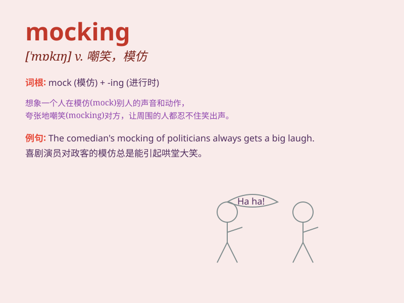

## mocking

**英音:** _[ˈmɒkɪŋ]_ **美音:** _[ˈmɑːkɪŋ]_

**译义:** *adj. 嘲笑的，模仿的；n. 嘲笑，模仿；v. 嘲笑，模仿(mock
的现在分词形式)*

### 短语

+ **mocking smile:** _嘲笑的微笑_

+ **mocking tone:** _嘲讽的语气_

+ **mocking laughter:** _嘲弄的笑声_

+ **mocking look:** _嘲笑的表情_

+ **mocking comment:** _讽刺的评论_

### 例句

#### 例句1

> **He gave a mocking laugh when I made a mistake.**

**中文翻译:** 当我犯错时，他发出了嘲笑的笑声。

**单词释义:** 嘲笑的

#### 例句2

> **Her mocking tone made me feel uncomfortable.**

**中文翻译:** 她嘲笑的语气让我感到不舒服。

**单词释义:** 嘲笑的

#### 例句3

> **The mocking comments from the audience were discouraging.**

**中文翻译:** 观众的嘲笑评论令人沮丧。

**单词释义:** 嘲笑的

### 背诵小故事

> A bird was mocking a cat. The cat couldn\'t catch the bird. It was
very angry. The bird\'s mocking made the cat feel frustrated. Mocking
here means teasing or making fun of someone in an unkind way.

**一只鸟在嘲笑一只猫。猫抓不到鸟，非常生气。鸟的嘲笑让猫感到沮丧。这里的\'mocking\'意思是不友善地取笑或嘲弄某人。**

### 图义

