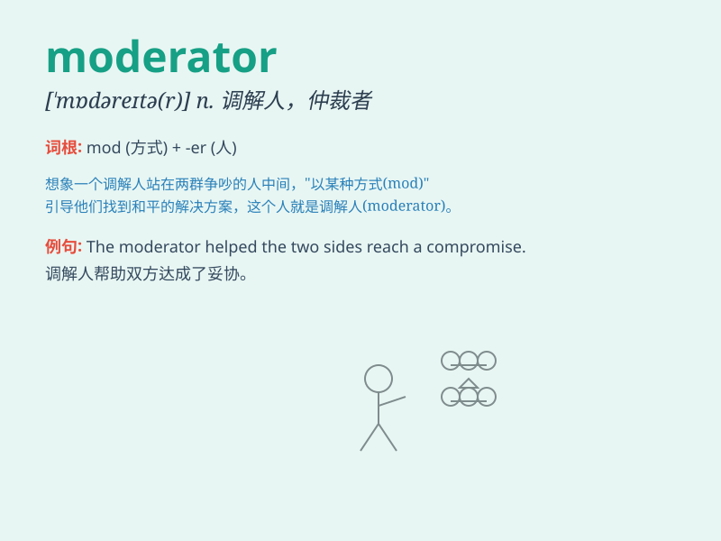

## moderator

**英音:** _[\'mɒdəreɪtə]_ **美音:** _[\'mɑdəretɚ]_

**译义:** *n.缓和剂*

### 短语

+ **forum moderator:** _论坛版主_

+ **debate moderator:** _辩论主持人_

+ **chatroom moderator:** _聊天室管理员_

+ **meeting moderator:** _会议主持人_

+ **discussion moderator:** _讨论主持人_

### 例句

#### 例句1

> **The moderator of the debate kept the conversation on track.**

**中文翻译:** 这场辩论的主持人让对话保持在正轨上。

**单词释义:** 主持人

#### 例句2

> **The forum has a strict moderator to ensure the quality of
discussions.**

**中文翻译:** 这个论坛有一位严格的版主以确保讨论的质量。

**单词释义:** 版主

#### 例句3

> **She acts as a moderator in the team, resolving conflicts.**

**中文翻译:** 她在团队中充当调解人的角色，解决冲突。

**单词释义:** 调解人

### 背诵小故事

> A group of people were arguing fiercely. Then the moderator came and
calmly listened to everyone. With fairness and wisdom, the moderator
helped them reach an agreement. The moderator is like a peacemaker in
chaos.

**一群人在激烈地争论。然后主持人来了，平静地倾听每个人的意见。凭借公平和智慧，主持人帮助他们达成了协议。主持人就像混乱中的调解人。**

### 图义

