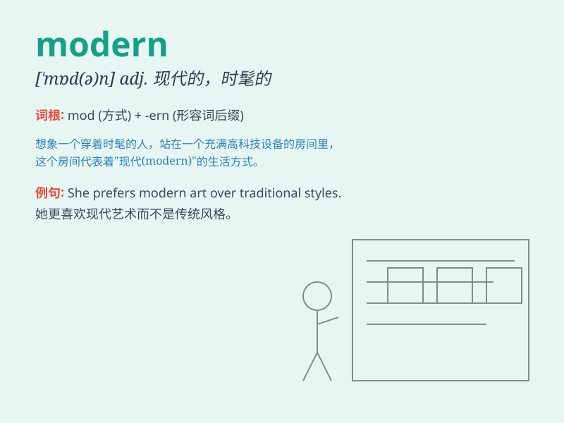

## modern

**英音:** _[\'mɒd(ə)n]_ **美音:** _[\'mɑdɚn]_

**译义:** *n.现代人,有思想的人adj.近代的,现代的,现代化的,时髦的*

### 短语

+ **modern art:** _现代艺术_

+ **modern technology:** _现代技术_

+ **modern society:** _现代社会_

+ **modern language:** _现代语言_

+ **modern architecture:** _现代建筑_

### 例句

#### 例句1

> **Modern technology has greatly changed our lives.**

**中文翻译:** 现代技术极大地改变了我们的生活。

**单词释义:** 现代的

#### 例句2

> **She has a very modern outlook on life.**

**中文翻译:** 她对生活有着非常现代的看法。

**单词释义:** 现代的；时髦的

#### 例句3

> **The museum showcases modern art.**

**中文翻译:** 这个博物馆展示现代艺术。

**单词释义:** 现代的

### 背诵小故事

> A young traveler was lost in an ancient town. But when he found a
modern building with shiny glass and steel, he knew he was on the right
track. The modern structure stood out among the old.

**一位年轻的旅行者在一个古老的城镇迷路了。但当他发现一座有着闪亮玻璃和钢铁的现代建筑时，他知道自己走对路了。这座现代建筑在古老的城镇中显得格外突出。**

### 图义

