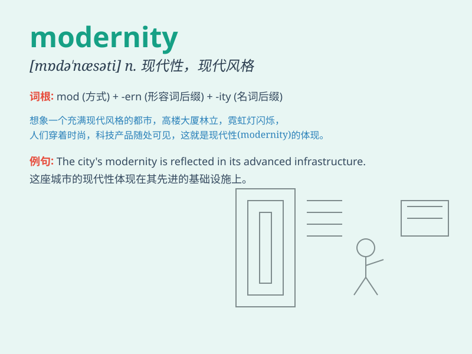

## modernity

**英音:** _[mə\'dɜːnɪtɪ]_ **美音:** _[mə\'dɝnəti]_

**译义:** *n.现代性*

### 短语

+ **post-modernity:** _后现代性_

+ **late modernity:** _晚期现代性_

+ **high modernity:** _高度现代性_

+ **reflexive modernity:** _自反性现代性_

+ **liquid modernity:** _流动的现代性_

### 例句

#### 例句1

> **The rapid development of technology is a hallmark of
modernity.**

**中文翻译:** 技术的快速发展是现代性的一个标志。

**单词释义:** 现代性；现代的特质

#### 例句2

> **She is constantly exploring the challenges and opportunities
presented by modernity.**

**中文翻译:** 她不断探索现代性所带来的挑战和机遇。

**单词释义:** 现代性；现代的特点

#### 例句3

> **The art exhibition showcases the various expressions of
modernity.**

**中文翻译:** 这次艺术展览展示了现代性的各种表现形式。

**单词释义:** 现代性；现代的特征

### 背诵小故事

> A young artist traveled through time and witnessed the changes from
the past to the present. He saw how modernity brought new technologies
and ideas, like smart phones and skyscrapers. This experience made him
understand the meaning of modernity.

**一位年轻的艺术家穿越时空，见证了从过去到现在的变化。他看到现代性如何带来新的技术和理念，比如智能手机和摩天大楼。这次经历让他明白了现代性的含义。**

### 图义

