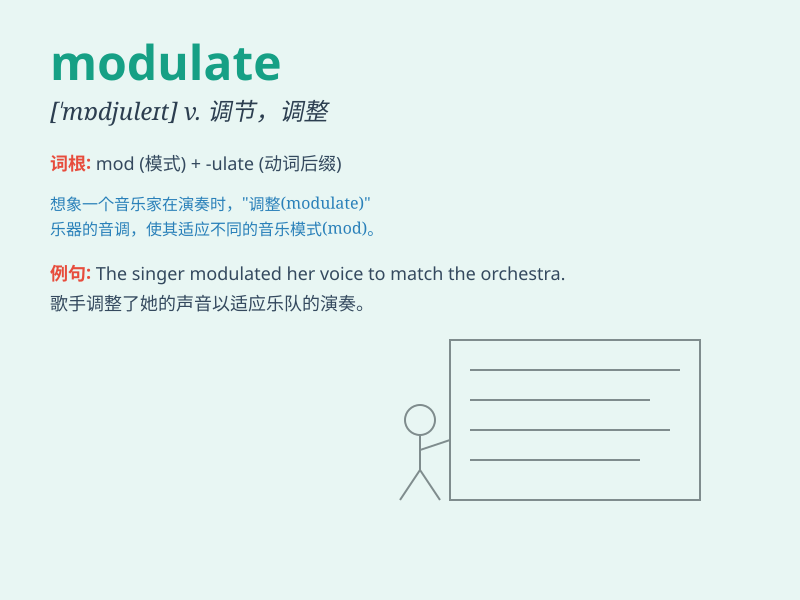

## modulate

**英音:** _[\'mɒdjʊleɪt]_ **美音:** _[\'mɑdʒəlet]_

**译义:** *vt.调整,调节,(信号)调制*

### 短语

+ **modulate frequency:** _调制频率_

+ **modulate signal:** _调制信号_

+ **modulate tone:** _调节音调_

+ **modulate amplitude:** _调制幅度_

+ **modulate voice:** _调节嗓音_

### 例句

#### 例句1

> **The singer modulated her voice skillfully to convey different
emotions.**

**中文翻译:** 这位歌手巧妙地调节她的嗓音以传达不同的情感。

**单词释义:** 调节；调整

#### 例句2

> **The radio signal is modulated to carry the information.**

**中文翻译:** 无线电信号被调制以携带信息。

**单词释义:** 调制

#### 例句3

> **He tried to modulate his tone to make the speech more
persuasive.**

**中文翻译:** 他试图调整自己的语气以使演讲更有说服力。

**单词释义:** 调整；改变

### 背诵小故事

>
想象一下，音乐家正在调制(modulate)乐器的声音，就像厨师精心调配食材一样。他不断调整音符的高低和强弱，使音乐变得美妙动听。

**想象音乐家调制乐器声音的情景来辅助记忆'modulate'这个单词，意为调节，调整**

### 图义

