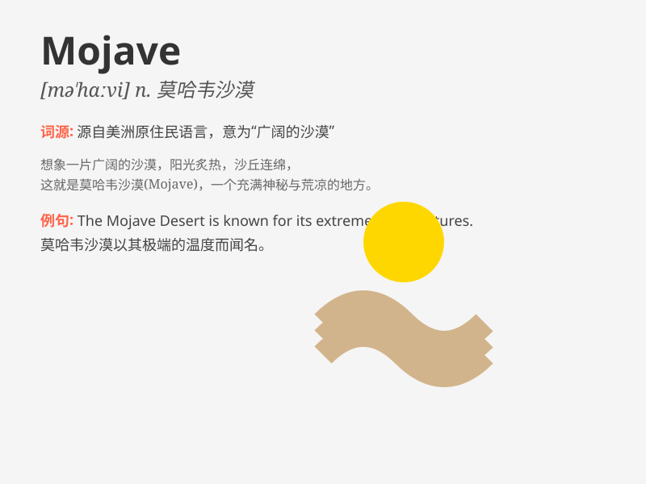

## Mojave

**英音:** __ **美音:** __

**译义:** *n.莫哈韦（美国加利福尼亚州南部的沙漠）*

### 短语

+ **Mojave Desert:** _莫哈韦沙漠_

+ **Mojave rattlesnake:** _莫哈韦响尾蛇_

+ **Mojave yucca:** _莫哈韦丝兰_

+ **Mojave National Preserve:** _莫哈韦国家保护区_

+ **Mojave Road:** _莫哈韦路_

### 例句

#### 例句1

> **The Mojave Desert is known for its extreme temperatures.**

**中文翻译:** 莫哈韦沙漠因其极端的温度而闻名。

**单词释义:** 莫哈韦（指莫哈韦沙漠）

#### 例句2

> **We went on a road trip through the Mojave.**

**中文翻译:** 我们进行了一次穿越莫哈韦的公路旅行。

**单词释义:** 莫哈韦（指莫哈韦地区）

#### 例句3

> **The Mojave has unique plant species.**

**中文翻译:** 莫哈韦有独特的植物物种。

**单词释义:** 莫哈韦（指莫哈韦地区）

### 背诵小故事

> A traveler got lost in the Mojave Desert. He was thirsty and tired
but finally found an oasis. The experience made him never forget the
name Mojave.

**一位旅行者在莫哈韦沙漠中迷路了。他又渴又累，但最终找到了一片绿洲。这次经历让他永远忘不了
Mojave 这个名字。**

### 图义

