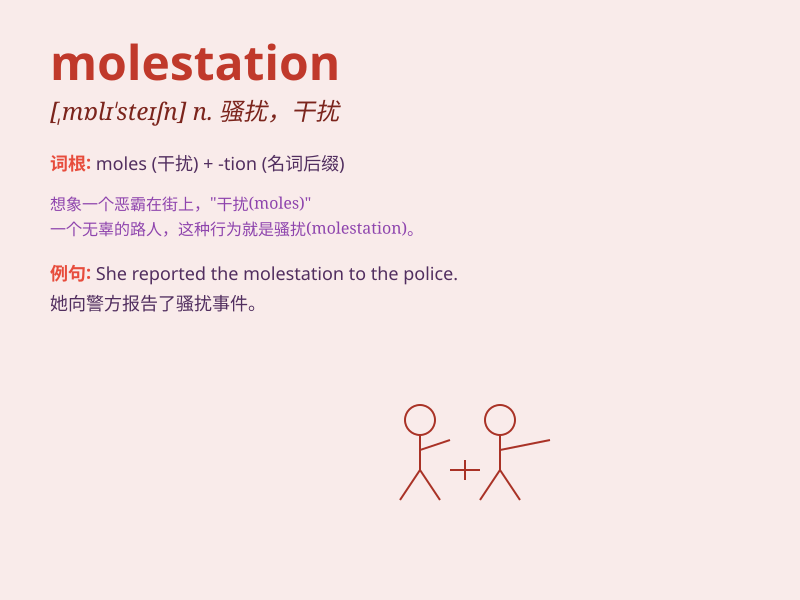

## molestation

**英音:** _[ˌmɒle\'steɪʃn]_ **美音:** _[ˌmɒle\'steɪʃn]_

**译义:** *n.骚扰,干扰,调戏*

### 短语

+ **sexual molestation:** _性侵犯_

+ **child molestation:** _儿童性骚扰_

+ **molestation case:** _骚扰案件_

+ **prevent molestation:** _防止骚扰_

+ **report molestation:** _报告骚扰行为_

### 例句

#### 例句1

> **The police are investigating a case of molestation in the
park.**

**中文翻译:** 警方正在调查公园里的一起性骚扰案件。

**单词释义:** 性骚扰

#### 例句2

> **She suffered molestation at the hands of her employer.**

**中文翻译:** 她遭受了雇主的性骚扰。

**单词释义:** 性骚扰

#### 例句3

> **Any form of molestation is strictly prohibited in this
institution.**

**中文翻译:** 在这个机构，任何形式的性骚扰都被严格禁止。

**单词释义:** 性骚扰

### 背诵小故事

> A little girl was walking alone in the park when a bad man approached
and tried to do molestation. Luckily, a policeman came in time and saved
her. Remember, molestation is a very bad behavior.

**一个小女孩独自在公园散步时，一个坏人靠近并试图进行骚扰。幸运的是，一名警察及时赶到救了她。记住，molestation
是一种非常恶劣的行为。**

### 图义

