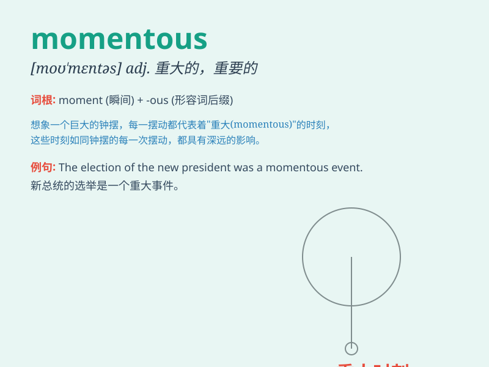

## momentous

**英音:** _[mə(ʊ)\'mentəs]_ **美音:** _[mo\'mɛntəs]_

**译义:** *adj.重大的,重要的*

### 短语

+ **momentous decision:** _重大决定_

+ **momentous event:** _重大事件_

+ **momentous occasion:** _重要场合_

+ **momentous change:** _重大变化_

+ **momentous step:** _重要步骤_

### 例句

#### 例句1

> **The discovery of penicillin was a momentous event in the history
of medicine.**

**中文翻译:** 青霉素的发现是医学史上的一个重大事件。

**单词释义:** 重大的；重要的

#### 例句2

> **This is a momentous decision that will change your life.**

**中文翻译:** 这是一个将改变你一生的重要决定。

**单词释义:** 重要的；关键的

#### 例句3

> **The company is at a momentous stage of its development.**

**中文翻译:** 公司正处于发展的重要阶段。

**单词释义:** 重大的；关键的

### 背诵小故事

> A young scientist was on the verge of a momentous discovery. Just as
she was about to give up, a sudden thought came to her mind and led to a
breakthrough. This was a truly momentous moment in her career.

**一位年轻的科学家即将有重大发现。就在她即将放弃时，突然一个想法出现在她脑海中，带来了突破。这是她职业生涯中真正重大的时刻。**

### 图义

