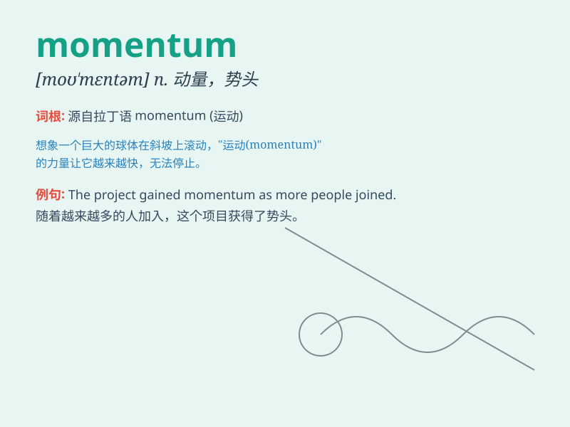

## momentum

**英音:** _[mə\'mentəm]_ **美音:** _[mo\'mɛntəm]_

**译义:** *n.动力,要素*

### 短语

+ **gain momentum:** _获得动力；势头增强_

+ **lose momentum:** _失去动力；势头减弱_

+ **momentum of change:** _变革的势头_

+ **momentum effect:** _动量效应_

+ **build momentum:** _建立势头；积聚动力_

### 例句

#### 例句1

> **The company is gaining momentum in the market.**

**中文翻译:** 这家公司在市场上的发展势头越来越猛。

**单词释义:** 势头；冲力

#### 例句2

> **The athlete needed to build up momentum before the jump.**

**中文翻译:** 这位运动员在起跳前需要积聚冲力。

**单词释义:** 冲力；动力

#### 例句3

> **The project has lost momentum and is in danger of stalling.**

**中文翻译:** 这个项目失去了势头，有停滞的危险。

**单词释义:** 势头；进展的动力

### 背诵小故事

> A little train was climbing a hill very slowly. But once it reached
the top and started going down, it gained momentum and went faster and
faster. The speed it picked up is like the \'momentum\' of success.

**一辆小火车爬坡爬得很慢。但一旦它到达山顶并开始下坡，它就获得了动力，速度越来越快。它获得的这种速度就像成功的"动力"。**

### 图义

