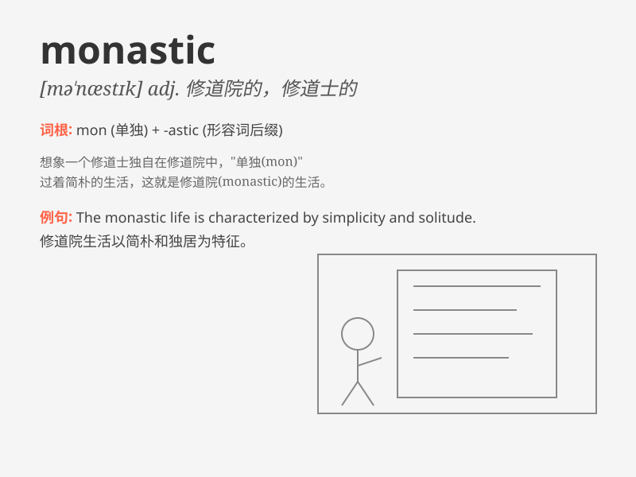

## monastic

**英音:** _[mə\'næstɪk]_ **美音:** _[mə\'næstɪk]_

**译义:** *n.僧侣,修道士adj.庙宇的*

### 短语

+ **monastic life:** _寺院生活；僧侣生活_

+ **monastic order:** _修道院制度；寺院教团_

+ **monastic discipline:** _寺院戒律；修道纪律_

+ **monastic community:** _寺院社区；修道团体_

+ **monastic retreat:** _寺院静修；修道隐居_

### 例句

#### 例句1

> **He led a monastic life, devoting himself to prayer and
meditation.**

**中文翻译:** 他过着僧侣般的生活，全身心投入到祈祷和冥想中。

**单词释义:** 僧侣般的；隐修的

#### 例句2

> **The monastery has a strict monastic code.**

**中文翻译:** 这座修道院有严格的修道院规则。

**单词释义:** 修道院的

#### 例句3

> **She was drawn to the monastic simplicity of the place.**

**中文翻译:** 她被这个地方的修道院式的简朴所吸引。

**单词释义:** 像修道院的；简朴的

### 背诵小故事

> A young man was lost and confused in the busy city. One day, he
decided to leave and enter a monastic life. There, he found peace and
simplicity, away from the chaos. He devoted himself to prayer and
meditation.

**一个年轻人在繁忙的城市中感到迷茫和失落。有一天，他决定离开并过上僧侣生活。在那里，他远离了喧嚣，找到了平静和简单，全身心投入到祈祷和冥想中。**

### 图义

