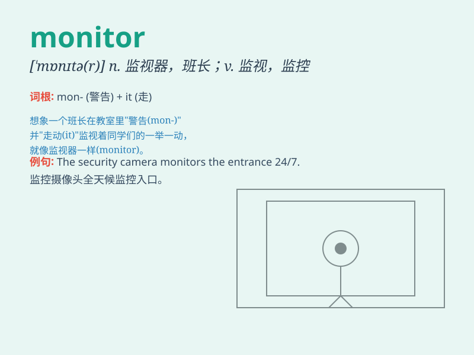

## monitor

**英音:** _[\'mɒnɪtə]_ **美音:** _[\'mɔnɪtɚ]_

**译义:** *n.班长,监听器,监视器,监控器vt.监控v.监控*

### 短语

+ **computer monitor:** _电脑显示器_

+ **video monitor:** _视频监视器_

+ **heart monitor:** _心脏监护仪_

+ **performance monitor:** _性能监视器_

+ **environmental monitor:** _环境监测器_

### 例句

#### 例句1

> **The teacher monitors the students\' progress closely.**

**中文翻译:** 老师密切关注学生的进步。

**单词释义:** 监视；监督

#### 例句2

> **The computer monitor suddenly went black.**

**中文翻译:** 电脑显示器突然黑了。

**单词释义:** 显示器；监视器

#### 例句3

> **She was elected as the monitor of the class.**

**中文翻译:** 她被选为班长。

**单词释义:** 班长

### 背诵小故事

> A little monkey was chosen as the monitor of the animal class. It had
to keep an eye on everyone\'s behavior. \'Monitor\' means to watch and
observe carefully, just like the monkey did.

**一只小猴子被选为动物班的班长。它必须留意每个人的行为。'monitor'意思是仔细观察和监视，就像猴子做的那样。**

### 图义

