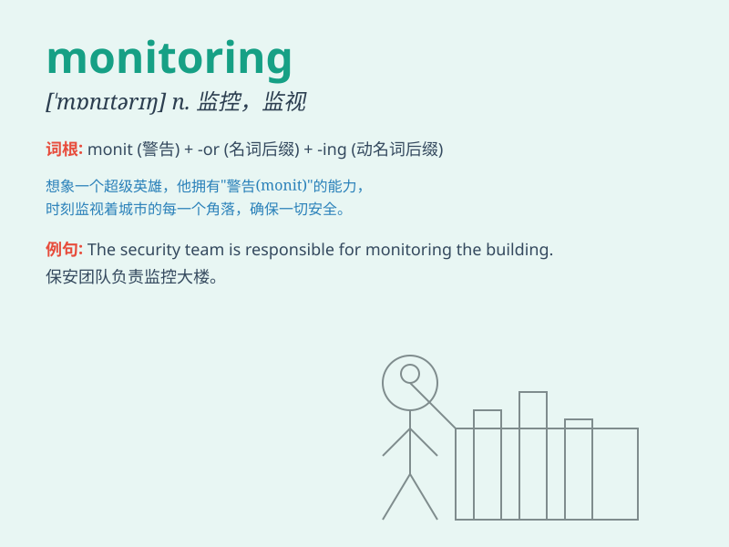

## monitoring

**英音:** _[ˈmɒnɪtərɪŋ]_ **美音:** _[ˈmɑːnɪtərɪŋ]_

**译义:** *n.监控，监测；v.监视，监听（monitor的现在分词形式）*

### 短语

+ **environmental monitoring:** _环境监测_

+ **performance monitoring:** _性能监测_

+ **quality monitoring:** _质量监测_

+ **remote monitoring:** _远程监测_

+ **system monitoring:** _系统监测_

### 例句

#### 例句1

> **The monitoring of air quality is crucial for public health.**

**中文翻译:** 对空气质量的监测对于公众健康至关重要。

**单词释义:** 监测

#### 例句2

> **We need to improve the monitoring system to prevent fraud.**

**中文翻译:** 我们需要改进监测系统以防止欺诈。

**单词释义:** 监测

#### 例句3

> **Constant monitoring of the patient\'s condition is necessary.**

**中文翻译:** 持续监测病人的状况是必要的。

**单词释义:** 监测

### 背诵小故事

> One day, a little detective was assigned the task of monitoring a
mysterious house. He had to watch carefully for any strange activities.
The word \'monitoring\' means to keep watch over something closely.

**有一天，一个小侦探被指派了监视一座神秘房子的任务。他必须仔细观察任何奇怪的活动。单词\'monitoring\'意思是密切注视某物。**

### 图义

