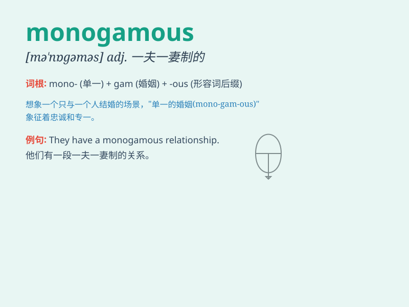

## monogamous

**英音:** _[mɒ\'nɒɡəməs]_ **美音:** _[mə\'nɑɡəməs]_

**译义:** *adj.一夫一妻的,[动]单配的,一雌一雄的*

### 短语

+ **monogamous relationship:** _一夫一妻制关系；单配偶关系_

+ **monogamous marriage:** _一夫一妻制婚姻_

+ **monogamous species:** _单配偶物种_

+ **monogamous behavior:** _单配偶行为_

+ **remain monogamous:** _保持一夫一妻制_

### 例句

#### 例句1

> **Most birds are monogamous for at least part of the breeding
season.**

**中文翻译:** 大多数鸟类至少在繁殖季节的一部分时间里是一夫一妻制的。

**单词释义:** 一夫一妻制的

#### 例句2

> **In some cultures, people have a monogamous marriage system.**

**中文翻译:** 在某些文化中，人们实行一夫一妻制的婚姻制度。

**单词释义:** 一夫一妻制的

#### 例句3

> **The couple leads a monogamous life and is very happy.**

**中文翻译:** 这对夫妇过着一夫一妻制的生活，非常幸福。

**单词释义:** 一夫一妻制的

### 背诵小故事

> A prince and princess were deeply in love. They promised to be
monogamous. They refused all temptations and spent their lives together
happily. \'Monogamous\' means having only one partner at a time.

**一位王子和公主深深相爱。他们承诺彼此专一。他们拒绝了所有诱惑，快乐地共度一生。\'monogamous\'意思是一次只有一个伴侣。**

### 图义

