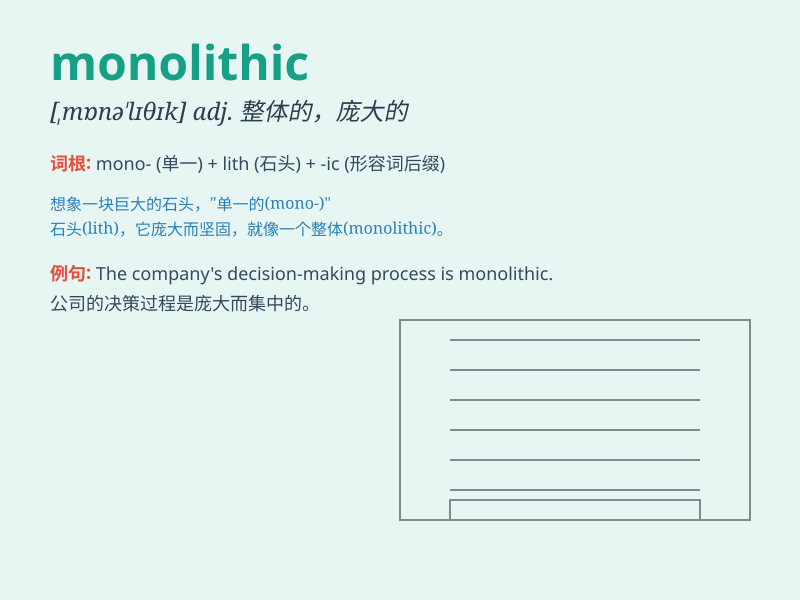

## monolithic

**英音:** _[mɒnə\'lɪθɪk]_ **美音:** _[,mɑnə\'lɪθɪk]_

**译义:** *n.单片电路,单块集成电路*

### 短语

+ **monolithic structure:** _整体结构；单片式结构_

+ **monolithic system:** _整体系统；单片系统_

+ **monolithic architecture:** _整体架构；单片式架构_

+ **monolithic approach:** _整体方法；单一方法_

+ **monolithic block:** _整块；整体块状物_

### 例句

#### 例句1

> **The company has a monolithic management structure that hinders
innovation.**

**中文翻译:** 该公司的管理结构单一，阻碍了创新。

**单词释义:** 单一的，整体的

#### 例句2

> **The building has a monolithic appearance, lacking any
architectural detail.**

**中文翻译:** 该建筑外观单一，缺乏任何建筑细节。

**单词释义:** 巨大而无变化的，单调的

#### 例句3

> **The political system was seen as monolithic and unresponsive to
the needs of the people.**

**中文翻译:** 政治体系被认为是铁板一块的，对人民的需求反应迟钝。

**单词释义:** 僵化的，刻板的

### 背诵小故事

> Imagine a huge, single stone structure that is so massive and
uniform. It stands alone, unbroken and unchanging - just like the
meaning of\'monolithic\'. This one-piece entity represents the idea of
being large, solid, and uniform.

**想象一个巨大的、单一的石头结构，它如此巨大、统一。它独自矗立，完整且不变------这就像"monolithic"这个词的意思。这个整体的实体代表了庞大、坚固和统一的概念。**

### 图义

