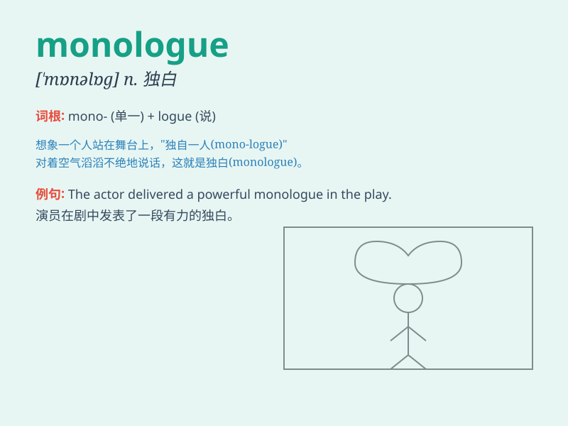

## monologue

**英音:** _[\'mɒn(ə)lɒg]_ **美音:** _[\'mɑnəlɔɡ]_

**译义:** *n.独白,独脚戏*

### 短语

+ **dramatic monologue:** _戏剧独白_

+ **inner monologue:** _内心独白_

+ **soliloquy monologue:** _自言自语的独白_

+ **extended monologue:** _长篇独白_

+ **emotional monologue:** _情感独白_

### 例句

#### 例句1

> **He delivered a passionate monologue about his dreams.**

**中文翻译:** 他对自己的梦想发表了充满激情的独白。

**单词释义:** 独白；长篇大论

#### 例句2

> **The actor\'s monologue in the play was very moving.**

**中文翻译:** 剧中演员的独白非常感人。

**单词释义:** 独白

#### 例句3

> **She broke the silence with a long monologue.**

**中文翻译:** 她用长长的独白打破了沉默。

**单词释义:** 长篇大论

### 背诵小故事

> A lonely actor was on the stage, delivering a long monologue. There
was no one to interact with him. He poured out his heart, and the
audience was deeply moved.

**一位孤独的演员站在舞台上，进行着一段长长的独白。没有人跟他互动。他倾诉着内心，观众深受感动。**

### 图义

