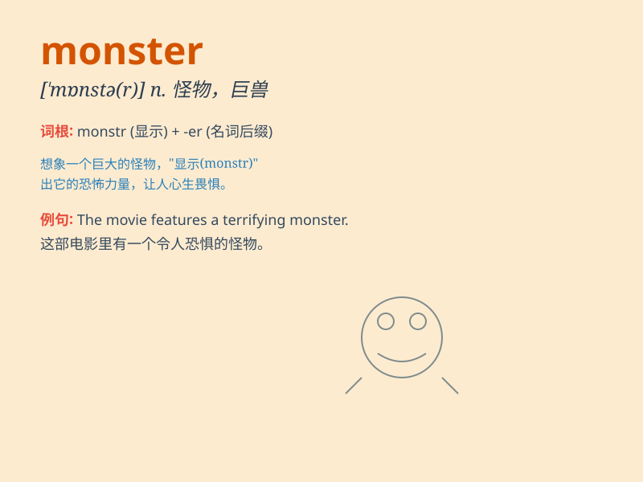

## monster

**英音:** _[\'mɒnstə]_ **美音:** _[\'mɑnstɚ]_

**译义:** *n.怪物,妖怪*

### 短语

+ **sea monster:** _海怪_

+ **monster truck:** _怪物卡车_

+ **monster movie:** _怪兽电影_

+ **monster storm:** _特大风暴_

+ **monster size:** _巨大的尺寸_

### 例句

#### 例句1

> **The monster under the bed scared the child.**

**中文翻译:** 床底下的怪物吓坏了孩子。

**单词释义:** 怪物；怪兽

#### 例句2

> **He became a monster after the accident.**

**中文翻译:** 事故发生后，他变成了怪物。

**单词释义:** 恶魔；恶人

#### 例句3

> **The sea monster is just a legend.**

**中文翻译:** 海怪只是一个传说。

**单词释义:** 怪物；巨兽

### 背诵小故事

> Once upon a time, in a dark forest, there was a huge MONSTER. It had
sharp teeth and scary eyes. Everyone was afraid of it. But a brave hero
came and defeated the monster to save the town.

**从前，在一片黑暗的森林里，有一只巨大的怪物。它有着锋利的牙齿和吓人的眼睛。每个人都害怕它。但是一位勇敢的英雄来了，打败了怪物，拯救了小镇。**

### 图义

