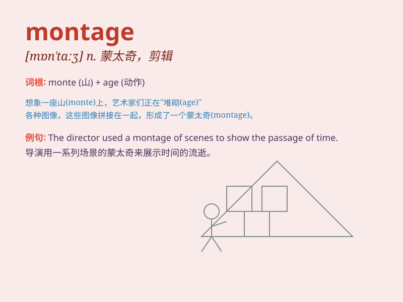

## montage

**英音:** _[mɒn\'tɑːʒ; \'mɒntɑːʒ]_ **美音:**
_[,mɑn\'tɑʒ]_

**译义:** *n.蒙太奇,文学音乐或美术的组合体*

### 短语

+ **video montage:** _视频剪辑_

+ **photo montage:** _照片蒙太奇_

+ **montage technique:** _蒙太奇手法_

+ **montage effect:** _蒙太奇效果_

+ **create a montage:** _创作一个蒙太奇_

### 例句

#### 例句1

> **The film uses a montage of images to convey the passage of
time.**

**中文翻译:** 影片使用蒙太奇图像来传达时间的流逝。

**单词释义:** 蒙太奇；组合；剪辑

#### 例句2

> **The artist created a beautiful montage of different colors and
textures.**

**中文翻译:** 艺术家创造了不同颜色和纹理的美丽蒙太奇。

**单词释义:** 蒙太奇；拼贴

#### 例句3

> **The presentation was enhanced by a montage of photos and
videos.**

**中文翻译:** 照片和视频的剪辑增强了演示的效果。

**单词释义:** 蒙太奇；剪辑组合

### 背诵小故事

> 想象一下，一位名叫 Monty
的艺术家，他特别擅长把各种不同的画作片段拼接在一起，创造出全新的、令人惊叹的作品。这种画作片段的拼接就像\'montage\'，充满创意和惊喜。

**想象一位叫 Monty
的艺术家通过拼接画作片段来理解\'montage\'（蒙太奇，拼贴画）这个词**

### 图义

