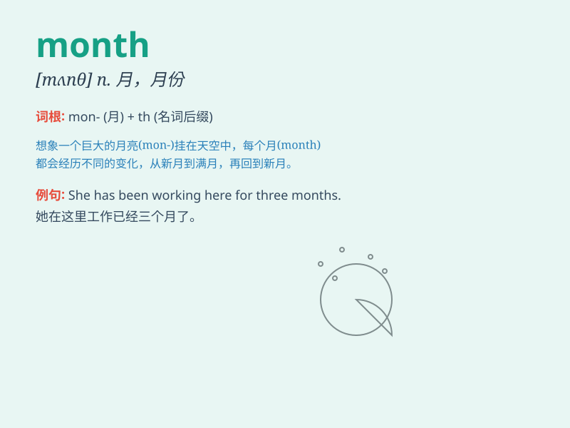

## month

**英音:** _[mʌnθ]_ **美音:** _[mʌnθ]_

**译义:** *n.月*

### 短语

+ **last month:** _上个月_

+ **next month:** _下个月_

+ **this month:** _这个月_

+ **month by month:** _逐月；每月_

+ **once a month:** _每月一次_

### 例句

#### 例句1

> **I will go on vacation next month.**

**中文翻译:** 下个月我将去度假。

**单词释义:** 月；月份

#### 例句2

> **She has been studying hard for months.**

**中文翻译:** 几个月来她一直在努力学习。

**单词释义:** 月；月份（复数形式）

#### 例句3

> **A month has passed since we last met.**

**中文翻译:** 距离我们上次见面已经过去一个月了。

**单词释义:** 月；一个月的时间

### 背诵小故事

> One day, a little ant was very busy. It was marking the passing of
time. Every 30 days or so, it would celebrate, because that was one
month. It knew months were like special milestones in the journey of
time.

**有一天，一只小蚂蚁非常忙碌。它在标记时间的流逝。每过大约 30
天，它就会庆祝，因为那是一个月。它知道月就像是时间旅程中的特殊里程碑。**

### 图义

