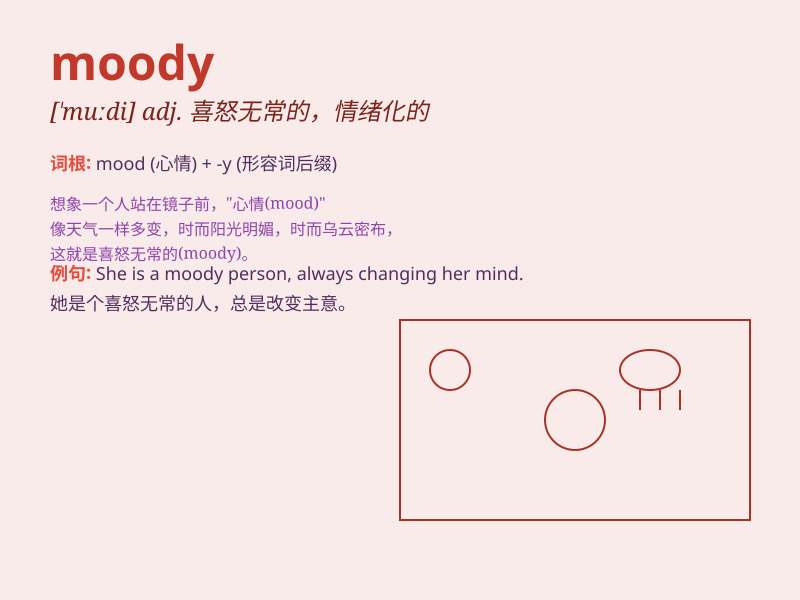

## moody

**英音:** _[\'muːdɪ]_ **美音:** _[\'mudi]_

**译义:** *adj.喜怒无常的,忧悒的*

### 短语

+ **in a moody state:** _处于喜怒无常的状态_

+ **moody teenager:** _喜怒无常的青少年_

+ **moody atmosphere:** _喜怒无常的气氛_

+ **moody expression:** _喜怒无常的表情_

+ **moody personality:** _喜怒无常的性格_

### 例句

#### 例句1

> **He has been moody and withdrawn lately.**

**中文翻译:** 他最近情绪低落，性格孤僻。

**单词释义:** 情绪多变的

#### 例句2

> **The moody teenager often locks herself in her room.**

**中文翻译:** 这个喜怒无常的青少年经常把自己锁在房间里。

**单词释义:** 喜怒无常的

#### 例句3

> **She gets moody when she\'s tired.**

**中文翻译:** 当她累的时候，她会变得情绪化。

**单词释义:** 情绪低落的

### 背诵小故事

> A moody prince was always changing his feelings. One day he was
happy, the next sad. His servants never knew how to please him.
\'Moody\' means having changing and unpredictable moods.

**一位喜怒无常的王子总是改变他的心情。一天他开心，第二天又悲伤。他的仆人永远不知道如何取悦他。\'moody\'意思是情绪多变且难以预测。**

### 图义

