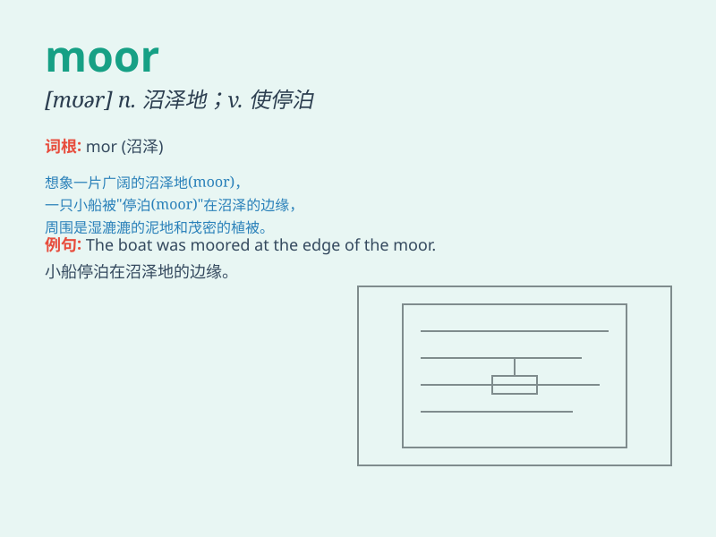

## moor

**英音:** _[mɔː(r)]_ **美音:** _[mʊr]_

**译义:** *n.沼地,荒野v.停泊,固定,系住*

### 短语

+ **moor land:** _高沼地；荒野_

+ **moor a boat:** _系泊船只_

+ **open moor:** _开阔的高沼地_

+ **the North York Moors:** _北约克高沼_

+ **moor sheep:** _荒原绵羊_

### 例句

#### 例句1

> **The ship was moored at the dock.**

**中文翻译:** 船停泊在码头。

**单词释义:** 系泊；停泊

#### 例句2

> **They moored the boat to a tree by the riverbank.**

**中文翻译:** 他们把船停泊在河边的一棵树上。

**单词释义:** 系；栓

#### 例句3

> **The car broke down on the moor and we had to walk for miles.**

**中文翻译:** 汽车在荒原上抛锚了，我们不得不步行数英里。

**单词释义:** 荒野；旷野

### 背诵小故事

> A brave knight was lost in the wild. He found a stable place to moor
his horse. The moor was vast and desolate, but it gave him a moment of
rest.

**一位勇敢的骑士在野外迷路了。他找了个稳定的地方系住他的马。这片荒野广阔而荒凉，但这让他得到了片刻的休息。**

### 图义

