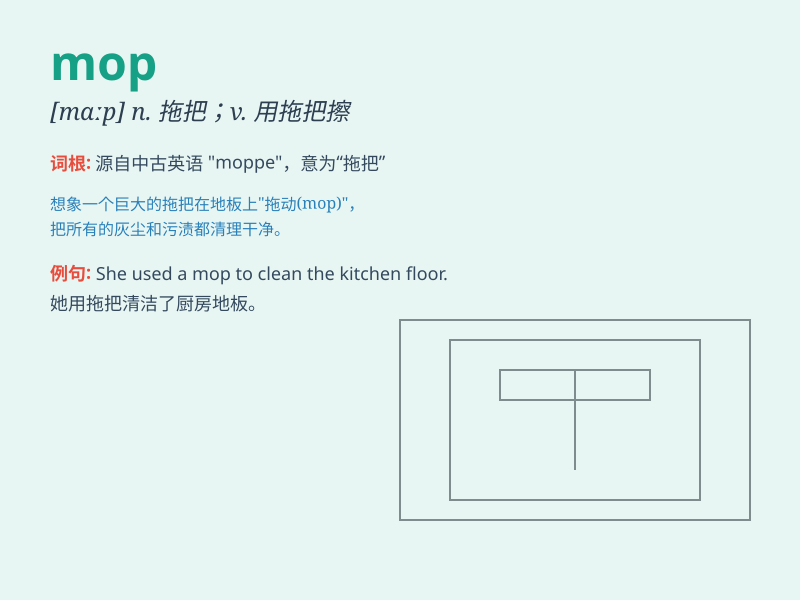

## mop

**英音:** _[mɒp]_ **美音:** _[mɑp]_

**译义:** *n.拖把(俗称地拖),洗碗v.用拖把拖洗,擦,抹,扫荡*

### 短语

+ **mop up:** _擦去；消灭；结束_

+ **mop the floor:** _拖地_

+ **mop the sweat:** _擦汗_

+ **mop one\'s brow:** _擦额头_

+ **mop and bucket:** _拖把和水桶_

### 例句

#### 例句1

> **She was mopping the floor when I entered the room.**

**中文翻译:** 我进房间时她正在拖地。

**单词释义:** 用拖把拖；擦

#### 例句2

> **He mopped his brow with a handkerchief.**

**中文翻译:** 他用手帕擦了擦额头。

**单词释义:** 擦；抹

#### 例句3

> **The waitress quickly mopped up the spilled coffee.**

**中文翻译:** 服务员很快就把洒出来的咖啡擦干净了。

**单词释义:** 擦干；抹去

### 背诵小故事

> One day, Tom was very tired after cleaning the room. The floor was
dirty, so he took a mop and started to clean it vigorously. Finally, the
floor became clean and shiny. Tom was happy with the result of his hard
work.

**一天，汤姆在打扫完房间后非常累。地板很脏，所以他拿了一个拖把，用力地开始清洁。最后，地板变得干净又闪亮。汤姆对自己努力的成果感到高兴。**

### 图义

