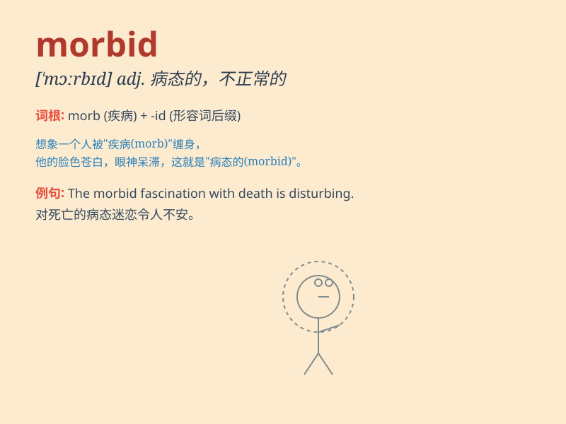

## morbid

**英音:** _[\'mɔːbɪd]_ **美音:** _[\'mɔrbɪd]_

**译义:** *adj.病的,由病引起的,病态的,恐怖的*

### 短语

+ **morbid curiosity:** _病态的好奇心_

+ **morbid fear:** _病态的恐惧_

+ **morbid imagination:** _病态的想象_

+ **morbid state:** _病态状态_

+ **morbid tendency:** _病态倾向_

### 例句

#### 例句1

> **He has a morbid fascination with death.**

**中文翻译:** 他对死亡有一种病态的迷恋。

**单词释义:** 病态的；不正常的

#### 例句2

> **The morbid atmosphere in the old house made her
uncomfortable.**

**中文翻译:** 老房子里病态的气氛让她很不舒服。

**单词释义:** 病态的；令人毛骨悚然的

#### 例句3

> **Her morbid imagination often led to nightmares.**

**中文翻译:** 她病态的想象力经常导致噩梦。

**单词释义:** 病态的；不健康的

### 背诵小故事

> A doctor was dealing with a morbid case. A patient had strange
symptoms that made everyone feel uneasy. The doctor worked hard to
understand and cure this abnormal and unhealthy condition. Finally, he
succeeded.

**一位医生正在处理一个病态的病例。一位患者有奇怪的症状，让每个人都感到不安。医生努力去理解并治愈这种不正常和不健康的状况。最后，他成功了。**

### 图义

