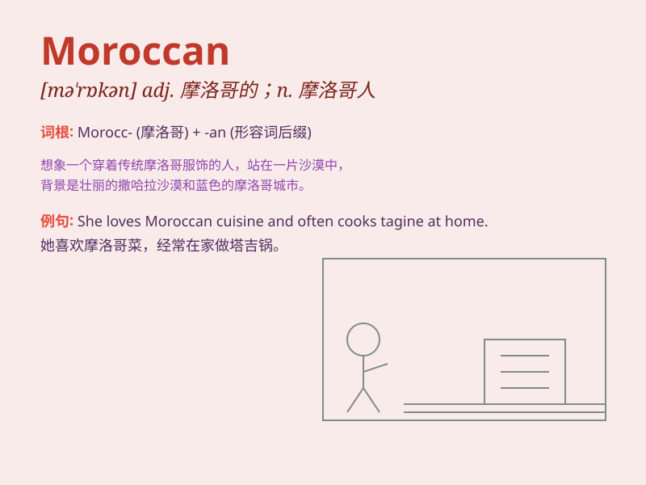

## Moroccan

**英音:** _[,mɔː\'rɒkən]_ **美音:** _[,mə\'rɑkən]_

**译义:** *adj. 摩洛哥的；摩洛哥产的；n. 摩洛哥人；摩洛哥皮；皮革*

### 短语

+ **Moroccan cuisine:** _摩洛哥美食_

+ **Moroccan carpet:** _摩洛哥地毯_

+ **Moroccan style:** _摩洛哥风格_

+ **Moroccan oil:** _摩洛哥油_

+ **Moroccan leather:** _摩洛哥皮革_

### 例句

#### 例句1

> **The Moroccan cuisine is famous for its rich flavors and
spices.**

**中文翻译:** 摩洛哥美食以其丰富的口味和香料而闻名。

**单词释义:** 摩洛哥的；摩洛哥人的

#### 例句2

> **She wore a beautiful Moroccan carpet as a shawl.**

**中文翻译:** 她披着一块漂亮的摩洛哥地毯当作披肩。

**单词释义:** 摩洛哥的

#### 例句3

> **The Moroccan athlete performed exceptionally well in the
competition.**

**中文翻译:** 这位摩洛哥运动员在比赛中表现得异常出色。

**单词释义:** 摩洛哥的

### 背诵小故事

> A Moroccan traveler got lost in a strange city. He met a kind local
who helped him find his way. The traveler was so grateful and remembered
the unique experience forever.

**一位摩洛哥旅行者在一个陌生的城市迷路了。他遇到了一位善良的当地人，帮助他找到了路。这位旅行者非常感激，并永远记住了这段独特的经历。**

### 图义

