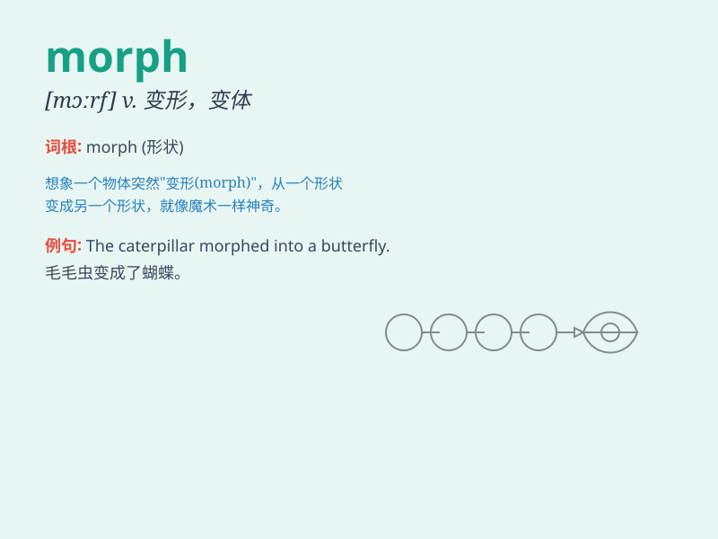

## morph

**英音:** _[mɔːf]_ **美音:** _[mɔrf]_

**译义:** *vi.改变形态；n.形态，外观；vt.使改变形态*

### 短语

+ **morph into:** _变成；变为_

+ **morph something/someone into something:**
_使某物/某人变成某物_

+ **morph from something to something:** _从某物演变成某物_

+ **undergo a morph:** _经历变形_

+ **morphological change:** _形态变化_

### 例句

#### 例句1

> **The caterpillar will morph into a butterfly.**

**中文翻译:** 毛毛虫将会变成蝴蝶。

**单词释义:** 转变；变形

#### 例句2

> **The city has morphed over the years.**

**中文翻译:** 这座城市多年来已经发生了变化。

**单词释义:** 变化；改变

#### 例句3

> **The software can morph one image into another seamlessly.**

**中文翻译:** 这个软件能够无缝地将一张图片变成另一张。

**单词释义:** 使变形；使转化

### 背诵小故事

>
想象一下，一只小毛毛虫（morph）努力地吃着叶子，慢慢长大，然后它的身体发生了神奇的变化，最终变成了一只美丽的蝴蝶。这就是\'morph\'，从一种形态变成另一种形态的过程。

**想象一只毛毛虫努力成长并发生形态变化的过程来记住\'morph\'表示形态变化的意思。**

### 图义

