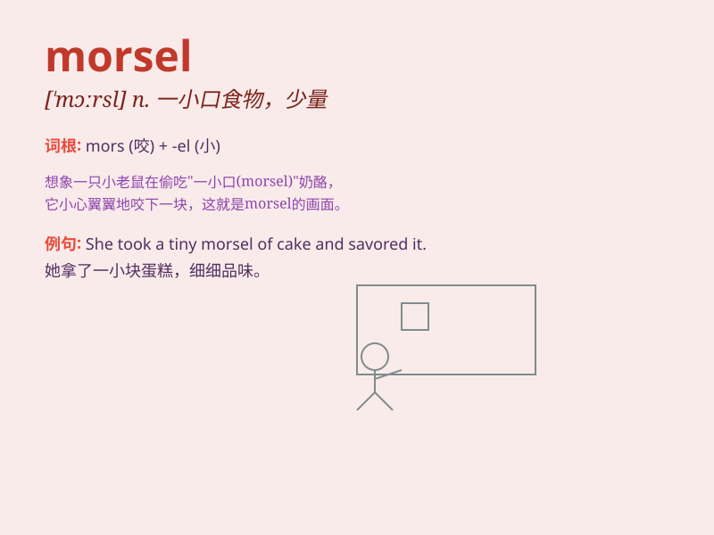

## morsel

**英音:** _[\'mɔːs(ə)l]_ **美音:** _[\'mɔrsl]_

**译义:** *n.(食物)一口,少量*

### 短语

+ **a morsel of food:** _一点食物_

+ **morsel by morsel:** _一点一点地_

+ **a tasty morsel:** _美味的一口_

+ **a small morsel:** _一小块_

+ **scrape up a morsel:** _勉强拼凑一点_

### 例句

#### 例句1

> **She savored every morsel of the delicious cake.**

**中文翻译:** 她品尝着每一口美味的蛋糕。

**单词释义:** 一小口；少量

#### 例句2

> **The hungry child gobbled up the morsel of bread.**

**中文翻译:** 饥饿的孩子狼吞虎咽地吃掉了一小块面包。

**单词释义:** 一小片；少量食物

#### 例句3

> **He refused to give even a morsel of information.**

**中文翻译:** 他甚至拒绝透露任何信息。

**单词释义:** 一点点；少量（非食物）

### 背诵小故事

> A hungry mouse was searching for food. Finally, it found a morsel of
cheese in a corner. It was so happy as this small piece of cheese saved
its day.

**一只饥饿的老鼠正在寻找食物。最后，它在一个角落里发现了一小块奶酪。它非常高兴，因为这一小口奶酪救了它。**

### 图义

