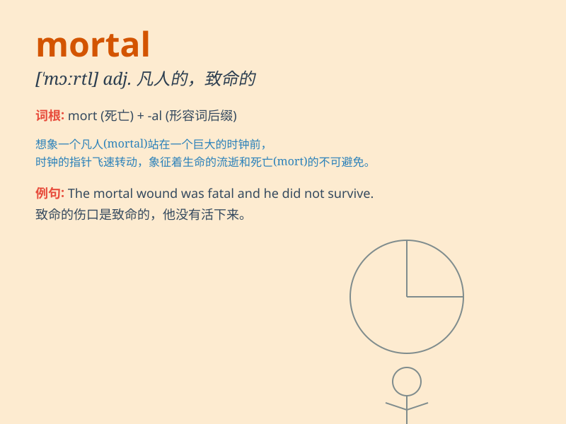

## mortal

**英音:** _[\'mɔːt(ə)l]_ **美音:** _[\'mɔrtl]_

**译义:**
*n.凡人,人类adj.必死的,致命的,人类的,临终的adj.\<口>极端的,非常大(长)的*

### 短语

+ **mortal sin:** _不可饶恕的大罪_

+ **mortal enemy:** _死敌_

+ **mortal remains:** _遗体；遗骸_

+ **mortal blow:** _致命的一击_

+ **mortal fear:** _极度的恐惧_

### 例句

#### 例句1

> **All men are mortal.**

**中文翻译:** 所有的人都会死。

**单词释义:** 终有一死的；不能永生的

#### 例句2

> **He received a mortal wound in the battle.**

**中文翻译:** 他在战斗中受了致命伤。

**单词释义:** 致命的

#### 例句3

> **The fear of death is a mortal terror for many people.**

**中文翻译:** 对于许多人来说，对死亡的恐惧是一种致命的恐惧。

**单词释义:** 极度的；重大的

### 背诵小故事

> In a magical land, a brave knight faced a powerful curse. The curse
was mortal, meaning it could bring death. The knight had to find a way
to break it to survive. Remember, mortal means causing or liable to
cause death.

**在一个神奇的国度，一位勇敢的骑士面临着一个强大的诅咒。这个诅咒是致命的，意味着它可能带来死亡。骑士必须想办法打破它才能生存。记住，mortal
意思是致死的、致命的。**

### 图义

