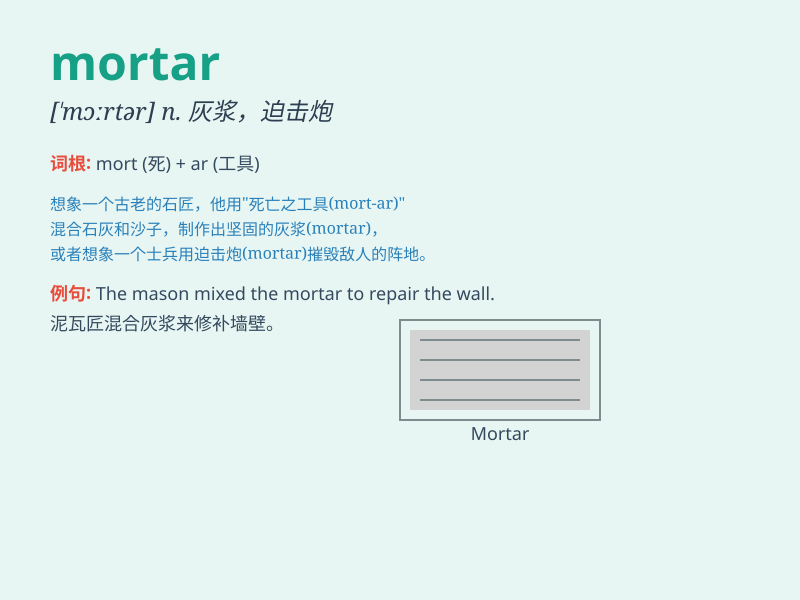

## mortar

**英音:** _[\'mɔːtə]_ **美音:** _[\'mɔrtɚ]_

**译义:** *n.臼,研钵,灰泥,迫击炮vt.用灰泥涂抹,用灰泥结合*

### 短语

+ **mortar board:** _学位帽；方顶帽_

+ **mortar joint:** _灰浆缝；灰缝_

+ **cement mortar:** _水泥砂浆_

+ **lime mortar:** _石灰砂浆_

+ **pointing mortar:** _勾缝灰浆_

### 例句

#### 例句1

> **The workers are using mortar to build the wall.**

**中文翻译:** 工人们正在用砂浆砌墙。

**单词释义:** 灰浆；砂浆

#### 例句2

> **The ancient building was held together with mortar.**

**中文翻译:** 这座古建筑是用砂浆固定在一起的。

**单词释义:** 灰浆

#### 例句3

> **The soldier fired the mortar at the enemy position.**

**中文翻译:** 士兵向敌人阵地发射迫击炮。

**单词释义:** 迫击炮

### 背诵小故事

> A brave soldier was in a battle. He used a mortar to launch powerful
projectiles and defend his comrades. The mortar was like his secret
weapon, giving them a chance to win.

**一位勇敢的士兵正在战斗。他使用迫击炮发射强大的炮弹来保卫他的战友。迫击炮就像他的秘密武器，给了他们获胜的机会。**

### 图义

