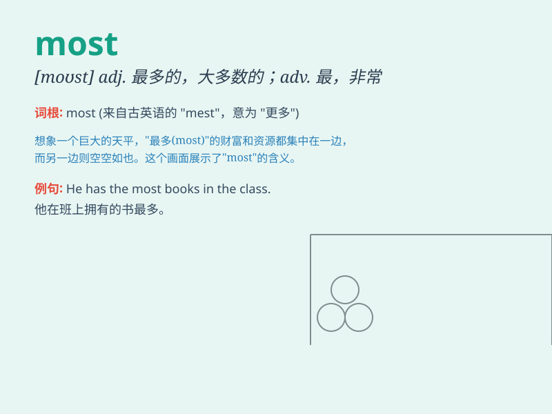

## most

**英音:** _[məʊst]_ **美音:** _[most]_

**译义:**
*adj.最多的,多数的,大部分的adv.最,最多,很,十分,最,最大的,其中大多数,极其n.大多数,大部分*

### 短语

+ **most of:** _大多数；大部分_

+ **at most:** _至多；不超过_

+ **for the most part:** _在很大程度上；多半_

+ **make the most of:** _充分利用；尽量利用_

+ **the most beautiful:** _最美丽的_

### 例句

#### 例句1

> **Most people like to travel during holidays.**

**中文翻译:** 大多数人喜欢在假期旅行。

**单词释义:** 大多数

#### 例句2

> **This is the most beautiful dress I have ever seen.**

**中文翻译:** 这是我见过的最漂亮的衣服。

**单词释义:** 最

#### 例句3

> **Most of the time, I stay at home and read books.**

**中文翻译:** 大多数时间我都呆在家里看书。

**单词释义:** 大多数

### 背诵小故事

> A king had many treasures. Among them, the pearl was the most
precious. But the king lost it. He searched everywhere and finally found
it. The pearl was the best and greatest of all.

**一位国王有许多财宝。在它们之中，珍珠是最珍贵的。但国王弄丢了它。他到处寻找，最终找到了。这颗珍珠是所有当中最好和最棒的。**

### 图义

