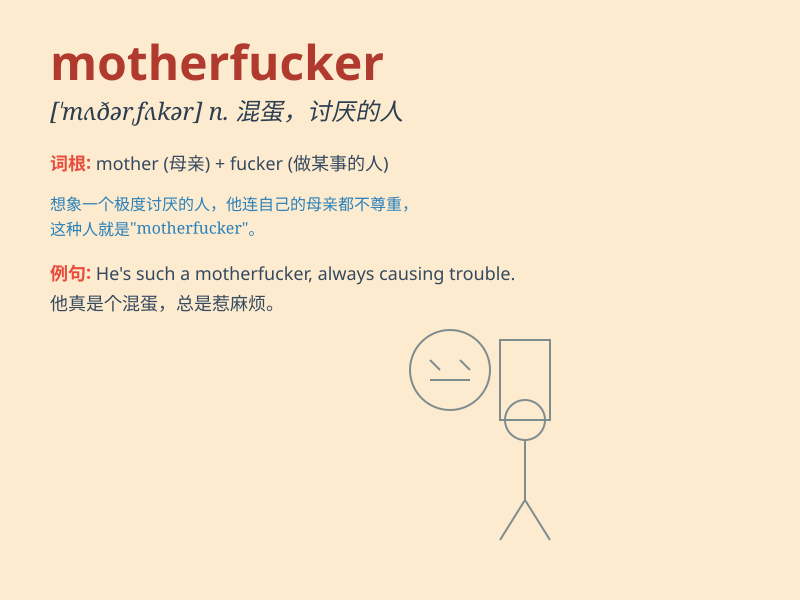

## motherfucker

**英音:** _[ˈmʌðəfʌkə]_ **美音:** _[ˈmʌðərˌfʌk.ər]_

**译义:**
*n.极其讨厌的人；（用于强调某人令人恼火的行为）可恶家伙（极粗鲁，尤用于口语）*

### 例句

#### 例句1

> **You motherfucker! How could you do that?**

**中文翻译:** 你这个混蛋！你怎么能那样做？

**单词释义:** 用于愤怒地辱骂某人

#### 例句2

> **Don\'t be such a motherfucker and stop messing around.**

**中文翻译:** 别这么混蛋，别再瞎捣乱了。

**单词释义:** 表示对某人不满或指责

#### 例句3

> **I can\'t stand that motherfucker anymore.**

**中文翻译:** 我再也受不了那个混蛋了。

**单词释义:** 强烈表达对某人的厌恶

### 背诵小故事

>
想象一个愤怒的场景，一个人在街上被另一个人挑衅，他愤怒地喊出\'motherfucker\'，表示对对方极度的愤怒和侮辱。这个词是非常粗俗和冒犯的，千万不要随意使用。

**想象一个愤怒的情境，某人在街上被挑衅后喊出'motherfucker'来表达极度愤怒和侮辱。此词粗俗冒犯，切勿乱用。**

### 图义

