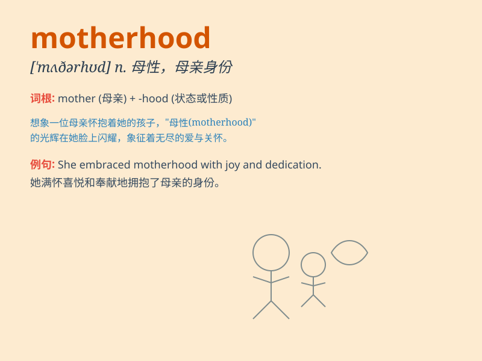

## motherhood

**英音:** _[\'mʌðəhʊd]_ **美音:** _[\'mʌðɚhʊd]_

**译义:** *n.母性,为母之道,母亲身份,母亲们(集合称)*

### 短语

+ **experience motherhood:** _体验母亲的身份_

+ **enter motherhood:** _成为母亲_

+ **celebrate motherhood:** _庆祝母亲的角色_

+ **embrace motherhood:** _欣然接受母亲的身份_

+ **understand motherhood:** _理解母亲的角色_

### 例句

#### 例句1

> **The joys and challenges of motherhood are unique to each
woman.**

**中文翻译:** 为人母的喜悦和挑战对每个女人来说都是独一无二的。

**单词释义:** 母性；母亲身份

#### 例句2

> **She embraced motherhood with enthusiasm and love.**

**中文翻译:** 她以热情和爱拥抱了母亲的身份。

**单词释义:** 母亲身份；母性

#### 例句3

> **Motherhood has taught her patience and selflessness.**

**中文翻译:** 母亲的身份教会了她耐心和无私。

**单词释义:** 母亲身份；母性

### 背诵小故事

> A young woman was nervous about motherhood. But when she held her
baby for the first time, she felt an overwhelming love. She learned that
motherhood is a journey full of joy and challenges.

**一位年轻女子对成为母亲感到紧张。但当她第一次抱起自己的孩子时，她感受到了一种无法抗拒的爱。她明白了母性是一段充满欢乐和挑战的旅程。**

### 图义

