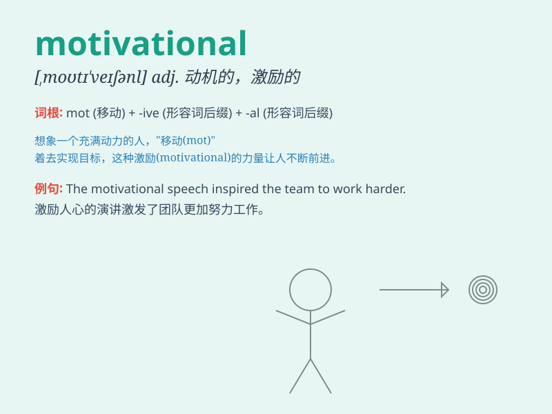

## motivational

**英音:** _[,məʊtɪ\'veɪʃənəl]_ **美音:**
_[,motə\'veʃənəl]_

**译义:** *adj.动机的,有关动机的*

### 短语

+ **motivational speech:** _激励性演讲_

+ **motivational factor:** _激励因素_

+ **motivational quote:** _激励性引言_

+ **motivational training:** _激励性培训_

+ **motivational book:** _励志书_

### 例句

#### 例句1

> **The motivational speech inspired the team to work harder.**

**中文翻译:** 励志演讲激励团队更加努力。

**单词释义:** 激励性的

#### 例句2

> **She reads motivational books to stay positive.**

**中文翻译:** 她阅读励志书籍以保持积极的态度。

**单词释义:** 激励性的

#### 例句3

> **The motivational poster on the wall encouraged employees to be
creative.**

**中文翻译:** 墙上的励志海报鼓励员工发挥创造力。

**单词释义:** 激励性的

### 背诵小故事

> A young artist was struggling. But one day, he saw a motivational
speech that sparked his creativity. The words filled him with energy and
made him believe in himself. Now he creates amazing art with passion.

**一位年轻的艺术家正在苦苦挣扎。但有一天，他看了一场激励人心的演讲，激发了他的创造力。这些话语让他充满能量，并使他相信自己。现在他满怀激情地创作着令人惊叹的艺术作品。**

### 图义

