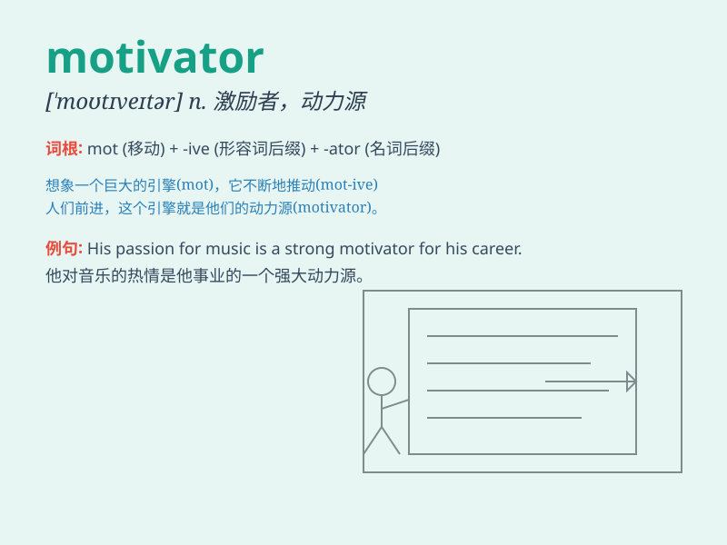

## motivator

**英音:** _[\'məʊtɪveɪtə]_ **美音:** _[\'motɪvetɚ]_

**译义:** *n.激起行为(或行动)的人(或事物),促进因素,激发因素*

### 短语

+ **strong motivator:** _强大的动力_

+ **effective motivator:** _有效的激励因素_

+ **internal motivator:** _内在动力_

+ **external motivator:** _外在激励因素_

+ **prime motivator:** _首要动力_

### 例句

#### 例句1

> **A good teacher can be a powerful motivator for students.**

**中文翻译:** 一个好的老师可以成为学生强大的动力。

**单词释义:** 动力源；激励因素

#### 例句2

> **His words served as a motivator to keep me going.**

**中文翻译:** 他的话成为了我继续前进的动力。

**单词释义:** 激励者；激发因素

#### 例句3

> **The promise of a reward was a great motivator for the team.**

**中文翻译:** 奖励的承诺对团队来说是一个巨大的激励。

**单词释义:** 激励因素；动力

### 背诵小故事

> A young artist was struggling to create. Then, a kind teacher
appeared as a motivator. The teacher\'s words and support gave the
artist the drive to keep going and achieve success. The teacher was the
key to unlocking the artist\'s potential.

**一位年轻的艺术家创作陷入困境。这时，一位善良的老师作为激励者出现了。老师的话语和支持给了艺术家继续前进并取得成功的动力。老师是开启艺术家潜力的关键。**

### 图义

