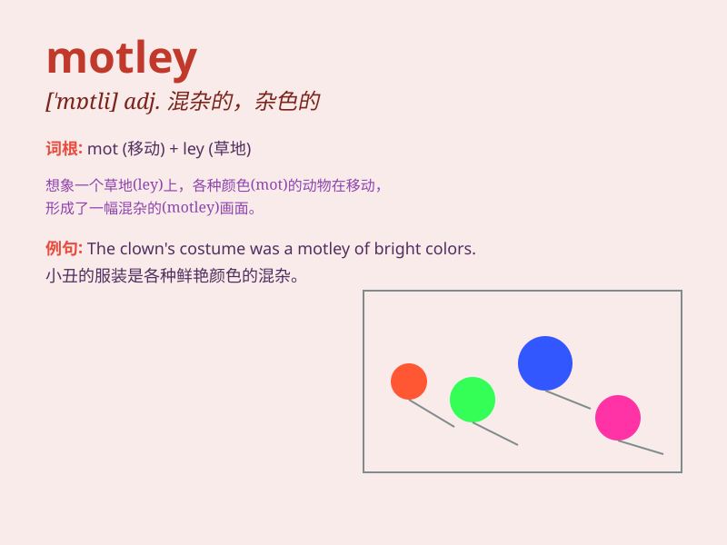

## motley

**英音:** _[\'mɒtlɪ]_ **美音:** _[\'mɑtli]_

**译义:**
*adj.杂色的,五颜六色的,穿染色衣的,混杂的n.杂色,杂色衣服,混杂,小丑*

### 短语

+ **motley crew:** _混杂的一群人_

+ **motley collection:** _杂七杂八的收集_

+ **motley assortment:** _各种各样的分类_

+ **in motley:** _穿着杂色衣服；五颜六色的_

+ **a motley array:** _杂色的排列_

### 例句

#### 例句1

> **The motley crew of adventurers set off on their quest.**

**中文翻译:** 一群形形色色的冒险家开始了他们的探索。

**单词释义:** 杂七杂八的；混杂的

#### 例句2

> **She wore a motley collection of second-hand clothes.**

**中文翻译:** 她穿着各种各样的二手衣服。

**单词释义:** 杂色的；五颜六色的

#### 例句3

> **The party was attended by a motley group of people from all walks
of life.**

**中文翻译:** 参加这次聚会的有来自各行各业的形形色色的人。

**单词释义:** 形形色色的；各种各样的

### 背诵小故事

> A group of clowns was preparing for a show. They wore motley costumes
of all colors and patterns. It was a wild and confusing mix, just like
the meaning of \'motley\' - diverse and mixed.

**一群小丑正在为一场表演做准备。他们穿着各种颜色和图案的杂色服装。那是一种狂野和混乱的混合，就像\'motley\'这个词的意思------多样的和混杂的。**

### 图义

