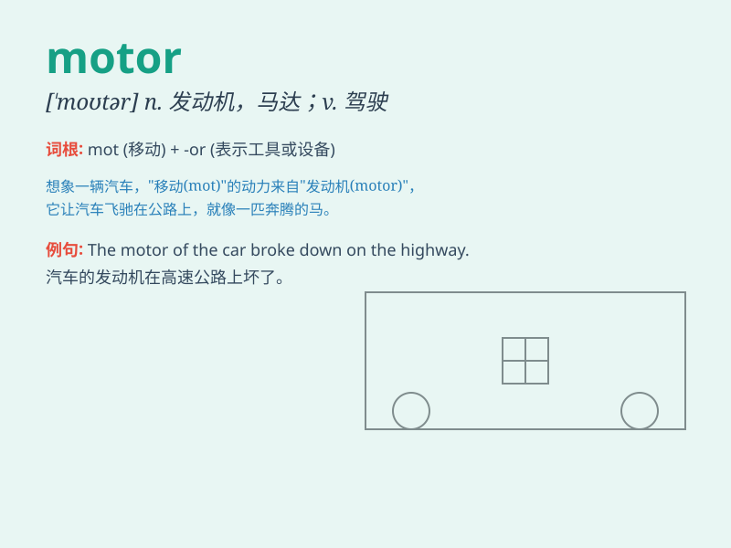

## motor

**英音:** _[\'məʊtə]_ **美音:** _[\'motɚ]_

**译义:** *n.发动机,电动机*

### 短语

+ **motor vehicle:** _机动车辆_

+ **motor oil:** _机油；马达油_

+ **motor nerve:** _运动神经_

+ **motor skills:** _运动技能_

+ **motor racing:** _赛车运动_

### 例句

#### 例句1

> **The motor of the car broke down.**

**中文翻译:** 汽车的发动机坏了。

**单词释义:** 发动机

#### 例句2

> **He rides a motorbike to work every day.**

**中文翻译:** 他每天骑摩托车去上班。

**单词释义:** 摩托车

#### 例句3

> **The motor is very powerful.**

**中文翻译:** 电机非常强大。

**单词释义:** 电动机

### 背诵小故事

> A man was lost in a forest. Suddenly, he heard the sound of a motor.
It was a rescue car coming to save him. The motor\'s noise gave him hope
and he was finally safe.

**一个男人在森林里迷路了。突然，他听到了发动机的声音。原来是一辆救援车来救他。发动机的声音给了他希望，他最终安全了。**

### 图义

