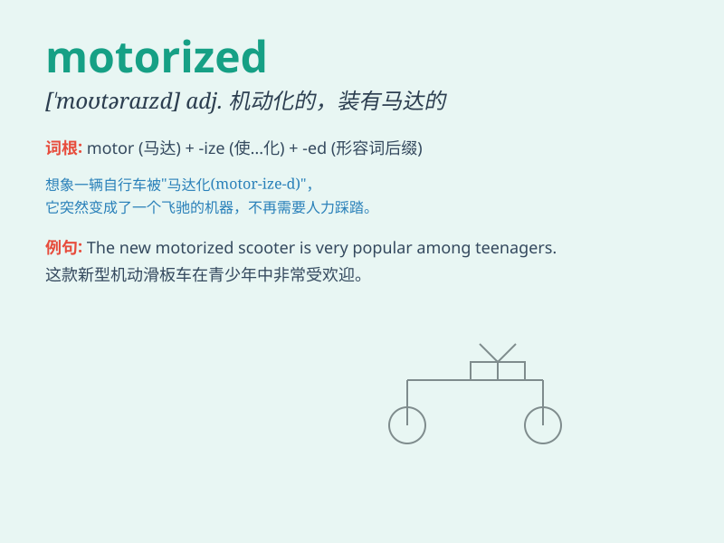

## motorized

**英音:** _[ˈməʊtəraɪzd]_ **美音:** _[ˈmoʊtəraɪzd]_

**译义:** *adj. 机动化的；摩托化的；装有发动机的*

### 短语

+ **motorized vehicle:** _机动车辆_

+ **motorized division:** _摩托化师_

+ **motorized infantry:** _摩托化步兵_

+ **motorized wheelchair:** _电动轮椅_

+ **motorized scooter:** _电动滑板车_

### 例句

#### 例句1

> **The police use motorized vehicles for patrolling the city.**

**中文翻译:** 警察使用机动交通工具在城市巡逻。

**单词释义:** 机动的

#### 例句2

> **The army has a large number of motorized units.**

**中文翻译:** 军队有大量的摩托化部队。

**单词释义:** 摩托化的；机动的

#### 例句3

> **The motorized wheelchair makes it easier for him to move
around.**

**中文翻译:** 机动轮椅使他更容易四处走动。

**单词释义:** 机动的

### 背诵小故事

> A group of adventurers was on a journey. Their vehicle broke down,
but luckily, they found a motorized bike. With its power, they continued
the adventure smoothly. The motorized bike saved the day!

**一群冒险家在旅途中。他们的车辆坏了，但幸运的是，他们找到了一辆机动自行车。凭借其动力，他们顺利地继续了冒险。机动自行车挽救了局面！**

### 图义

