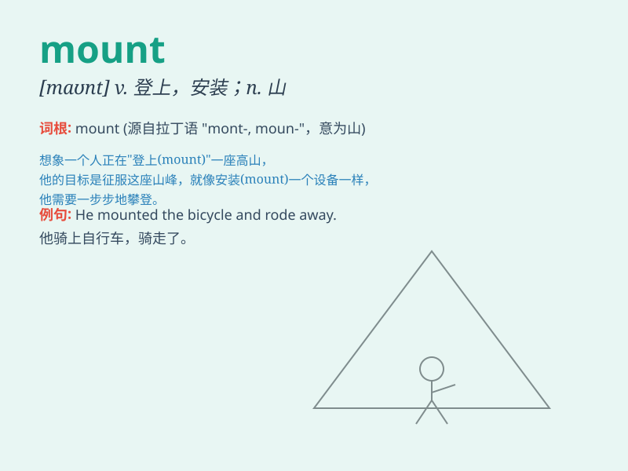

## mount

**英音:** _[maʊnt]_ **美音:** _[maʊnt]_

**译义:**
*n.乘用马,衬纸,山,装配vi.乘马,爬上,增长vt.爬上,使上马,装上,设置,安放,制作\...的标本,上演*

### 短语

+ **mount up:** _增加；上升_

+ **mount an attack:** _发动攻击_

+ **mount a campaign:** _发起一场运动_

+ **mount a defense:** _进行防御_

+ **mount a protest:** _发起抗议_

### 例句

#### 例句1

> **He decided to mount the horse and ride off into the sunset.**

**中文翻译:** 他决定骑上马，在夕阳中骑马离去。

**单词释义:** 骑上

#### 例句2

> **The museum has managed to mount an exhibition of Picasso\'s
works.**

**中文翻译:** 博物馆设法举办了一次毕加索作品的展览。

**单词释义:** 举办

#### 例句3

> **She carefully mounted the photograph in a beautiful frame.**

**中文翻译:** 她小心翼翼地把照片装在一个漂亮的相框里。

**单词释义:** 安装；镶嵌

### 背诵小故事

> A brave knight wanted to reach the top of the mountain. He had to
mount his horse and ride through difficult paths. Finally, he succeeded
and saw the beautiful view.

**一位勇敢的骑士想要到达山顶。他不得不骑上他的马，穿过艰难的道路。最后，他成功了，并看到了美丽的景色。**

### 图义

