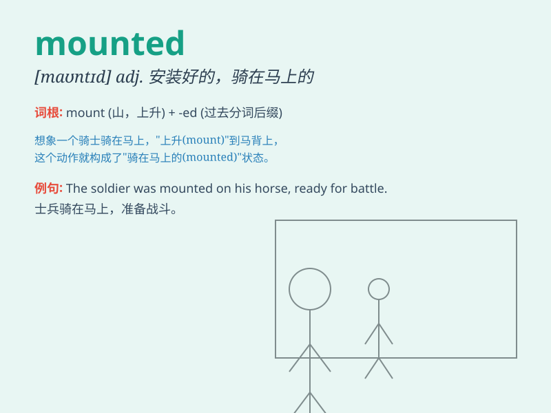

## mounted

**英音:** _[\'maʊntɪd]_ **美音:** _[\'maʊntɪd]_

**译义:** *adj.安在马上的,裱好的*

### 短语

+ **mounted police:** _骑警_

+ **mounted patrol:** _骑马巡逻队_

+ **mounted camera:** _固定摄像头_

+ **mounted soldier:** _骑马的士兵_

+ **mounted display:** _安装好的展示品_

### 例句

#### 例句1

> **The soldier mounted his horse and rode off into battle.**

**中文翻译:** 这名士兵骑上他的马，奔赴战场。

**单词释义:** 骑上

#### 例句2

> **The police officer mounted the curb to chase the thief.**

**中文翻译:** 警察骑上路缘去追小偷。

**单词释义:** 骑上；登上

#### 例句3

> **The museum has mounted an exhibition of ancient art.**

**中文翻译:** 博物馆举办了一场古代艺术展览。

**单词释义:** 举办；组织

### 背诵小故事

> A brave knight mounted his horse and rode towards the enemy\'s
castle. The horse was strong and the knight was determined. \'Mounted\'
here means to get on and be in position for riding or using.

**一位勇敢的骑士骑上他的马，朝着敌人的城堡奔去。这匹马很强壮，骑士也很坚定。这里的'mounted'意思是骑上，处于准备骑乘或使用的位置。**

### 图义

