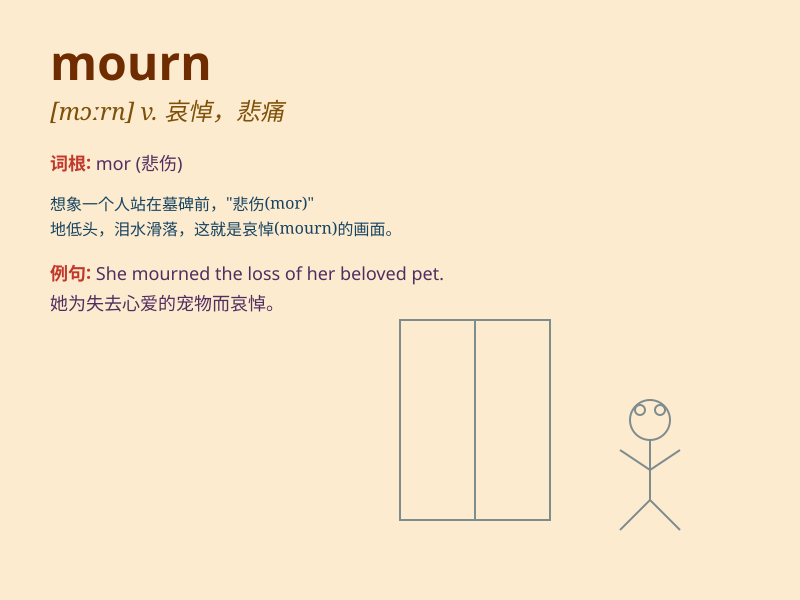

## mourn

**英音:** _[mɔːn]_ **美音:** _[mɔrn]_

**译义:** *v.哀悼,忧伤,服丧*

### 短语

+ **mourn for:** _为\...\...哀悼；悼念\...\..._

+ **mourn over:** _为\...\...悲伤；对\...\...表示悲痛_

+ **mourn the loss of:** _为\...\...的失去而悲痛_

+ **deeply mourn:** _深深地哀悼_

+ **publicly mourn:** _公开哀悼_

### 例句

#### 例句1

> **She mourned the loss of her beloved pet.**

**中文翻译:** 她为失去心爱的宠物而悲痛。

**单词释义:** 为\...\...悲痛

#### 例句2

> **The whole country mourned the death of the hero.**

**中文翻译:** 整个国家都为这位英雄的逝世而哀悼。

**单词释义:** 哀悼

#### 例句3

> **He still mourns his father who passed away ten years ago.**

**中文翻译:** 他仍然为十年前去世的父亲感到哀伤。

**单词释义:** 感到哀伤

### 背诵小故事

> A king lost his most trusted advisor. The whole kingdom was in
sadness. Everyone wore black to mourn the advisor\'s death. The king sat
alone, tears in his eyes, remembering the good times they had together.

**一位国王失去了他最信任的顾问。整个王国都沉浸在悲伤之中。每个人都身着黑色来悼念顾问的离世。国王独自坐着，眼中含泪，回忆着他们曾经在一起的美好时光。**

### 图义

