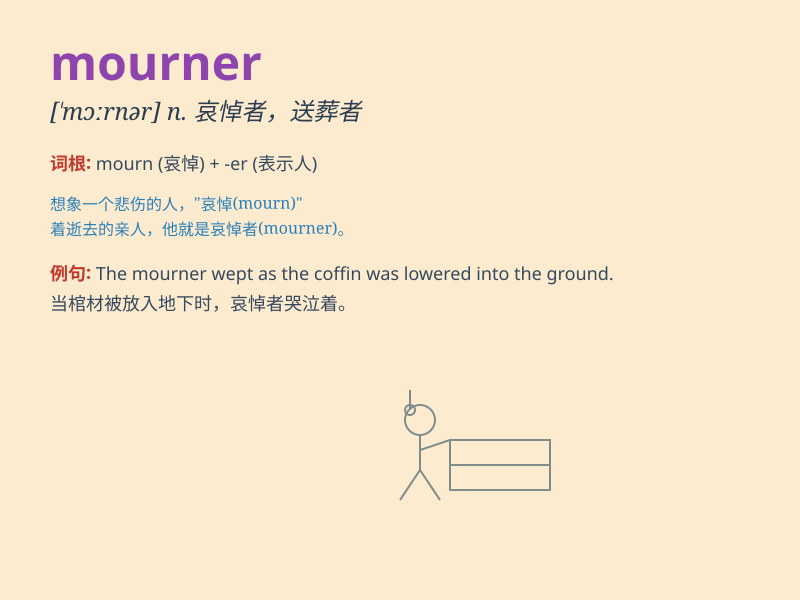

## mourner

**英音:** _[\'mɔːnə]_ **美音:** _[\'mɔrnɚ]_

**译义:** *n.悲伤者,哀悼者,忏悔者*

### 短语

+ **professional mourner:** _职业哀悼者_

+ **chief mourner:** _主要哀悼者_

+ **silent mourner:** _沉默的哀悼者_

+ **weeping mourner:** _哭泣的哀悼者_

+ **bereaved mourner:** _失去亲人的哀悼者_

### 例句

#### 例句1

> **The mourner stood by the grave, tears streaming down her
face.**

**中文翻译:** 这位哀悼者站在坟墓旁，泪水顺着她的脸颊流下。

**单词释义:** 哀悼者

#### 例句2

> **Among the mourners at the funeral were several of his closest
friends.**

**中文翻译:** 在葬礼上的哀悼者中有他的几个最亲密的朋友。

**单词释义:** 哀悼者

#### 例句3

> **The silent mourner held a single white rose in her hand.**

**中文翻译:** 这位沉默的哀悼者手里拿着一朵白玫瑰。

**单词释义:** 哀悼者

### 背诵小故事

> A mourner was walking alone in the cemetery. Tears rolled down as
they remembered the loved one who had passed away. The mourner\'s heart
was filled with sadness and longing.

**一位哀悼者独自在墓地里走着。泪水滚落，因为他们想起了已经逝去的挚爱之人。这位哀悼者的心中充满了悲伤和思念。**

### 图义

