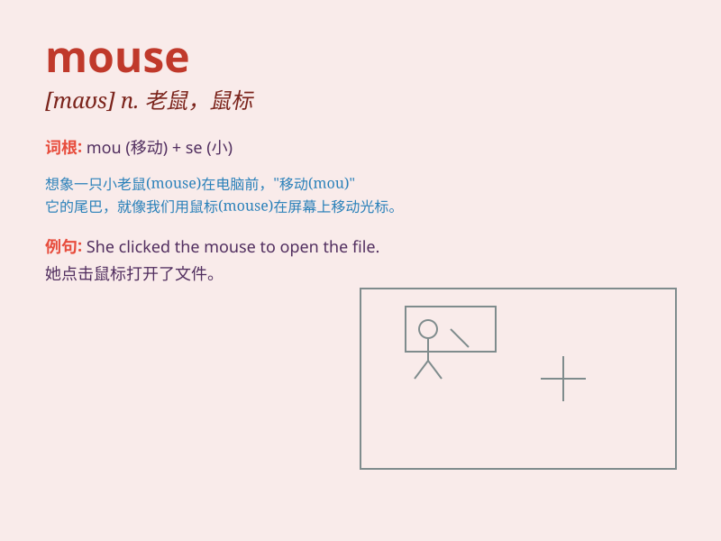

## mouse

**英音:** _[maʊs]_ **美音:** _[maʊs]_

**译义:** *n.鼠,耗子v.搜寻*

### 短语

+ **mouse pad:** _鼠标垫_

+ **mouse click:** _鼠标点击_

+ **field mouse:** _田鼠_

+ **house mouse:** _家鼠_

+ **mouse trap:** _捕鼠器_

### 例句

#### 例句1

> **The mouse scurried across the floor.**

**中文翻译:** 这只老鼠匆匆跑过地板。

**单词释义:** 老鼠

#### 例句2

> **Use the mouse to click on the icon.**

**中文翻译:** 用鼠标点击这个图标。

**单词释义:** 鼠标

#### 例句3

> **She is as quiet as a mouse.**

**中文翻译:** 她像老鼠一样安静。

**单词释义:** 老鼠（比喻胆小、安静）

### 背诵小故事

> One day, a little mouse was looking for food in a big house. It was
very quiet. Suddenly, it heard a noise and quickly hid. But it was just
a cat\'s toy. The mouse was so lucky!

**有一天，一只小老鼠在一个大房子里找食物。四周非常安静。突然，它听到一个声响，迅速躲了起来。但那只是一只猫的玩具。这只老鼠太幸运了！**

### 图义

