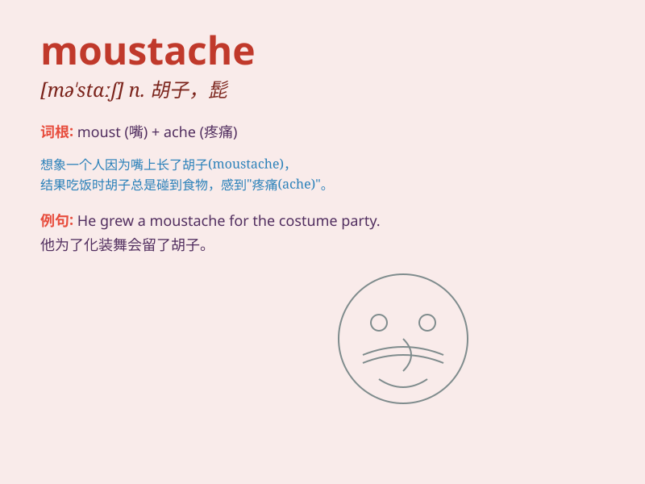

## moustache

**英音:** _[mə\'stɑːʃ]_ **美音:** _[mə\'stɑʃ]_

**译义:** *n.小胡子,(哺乳动物的)触须*

### 短语

+ **handlebar moustache:** _翘八字胡_

+ **walrus moustache:** _海象式胡子_

+ **waxed moustache:** _打蜡的胡子_

+ **curly moustache:** _卷曲的胡子_

+ **thick moustache:** _浓密的胡子_

### 例句

#### 例句1

> **He has a thick black moustache.**

**中文翻译:** 他有浓密的黑色胡子。

**单词释义:** 胡子；髭

#### 例句2

> **The man with the long moustache is my uncle.**

**中文翻译:** 那个留着长胡子的男人是我叔叔。

**单词释义:** 胡子；髭

#### 例句3

> **She couldn\'t help laughing at his funny moustache.**

**中文翻译:** 她忍不住嘲笑他那滑稽的胡子。

**单词释义:** 胡子；髭

### 背诵小故事

> One day, a little boy saw a funny man with a thick and curly
moustache. The moustache looked like a pair of black caterpillars on his
upper lip. The boy couldn\'t forget that strange and interesting
moustache.

**一天，一个小男孩看到一个有趣的男人，他有着浓密卷曲的胡子。胡子看起来就像他上唇的两条黑色毛毛虫。这个男孩无法忘记那奇怪又有趣的胡子。**

### 图义

