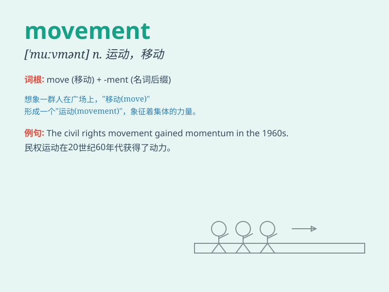

## movement

**英音:** _[\'muːvm(ə)nt]_ **美音:** _[\'muvmənt]_

**译义:** *n.运动,动作,运转,乐章*

### 短语

+ **political movement:** _政治运动_

+ **eye movement:** _眼球运动_

+ **peace movement:** _和平运动_

+ **artistic movement:** _艺术运动_

+ **women\'s movement:** _妇女运动_

### 例句

#### 例句1

> **The movement of the dancers was graceful and fluid.**

**中文翻译:** 舞者们的动作优美流畅。

**单词释义:** 动作

#### 例句2

> **There has been a growing movement against pollution in the
city.**

**中文翻译:** 这座城市里反对污染的运动日益壮大。

**单词释义:** 运动

#### 例句3

> **The doctor checked the patient\'s eye movement.**

**中文翻译:** 医生检查了病人的眼球运动。

**单词释义:** 运动

### 背诵小故事

> One day, a little ant was on a big movement to find food. It moved
along the path, never stopping. Finally, it found a lot of delicious
food. This is the story of the ant\'s movement.

**有一天，一只小蚂蚁正在进行一场寻找食物的大行动。它沿着小路移动，从未停歇。最终，它找到了许多美味的食物。这就是关于蚂蚁行动的故事。**

### 图义

