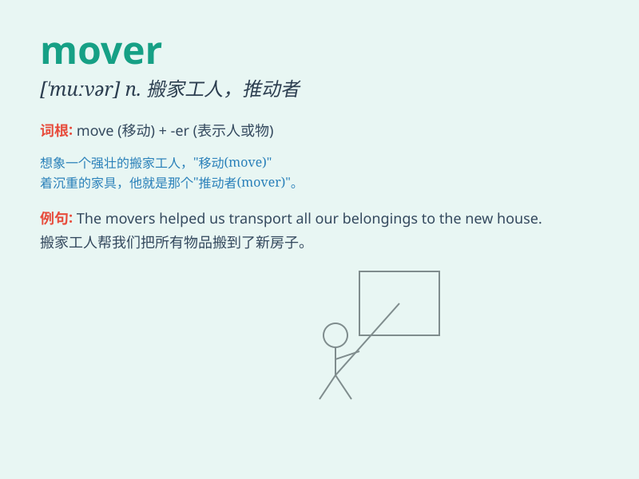

## mover

**英音:** _[\'muːvə]_ **美音:** _[\'muvɚ]_

**译义:** *n.行动者,搬运家具的人,原动力,鼓吹者*

### 短语

+ **prime mover:** _原动力；主要推动者_

+ **furniture mover:** _家具搬运工_

+ **emotional mover:** _情感触动者_

+ **movers and shakers:** _有权势的人；具有影响力的人物_

+ **professional mover:** _专业搬运工_

### 例句

#### 例句1

> **The movers carefully lifted the heavy furniture onto the
truck.**

**中文翻译:** 搬运工们小心地把沉重的家具抬到卡车上。

**单词释义:** 搬运工

#### 例句2

> **She is a powerful mover in the political arena.**

**中文翻译:** 她是政治舞台上一位有影响力的推动者。

**单词释义:** 推动者

#### 例句3

> **The new policy was a major mover for economic growth.**

**中文翻译:** 新政策是经济增长的主要推动因素。

**单词释义:** 推动因素

### 背诵小故事

> A man was trying to move a heavy box. He struggled a lot but didn\'t
give up. Finally, he became a great mover and could handle any heavy
things easily.

**一个男人试图搬动一个沉重的箱子。他费了很大劲但没有放弃。最终，他成为了一个出色的搬运工，能够轻松处理任何重物。**

### 图义

