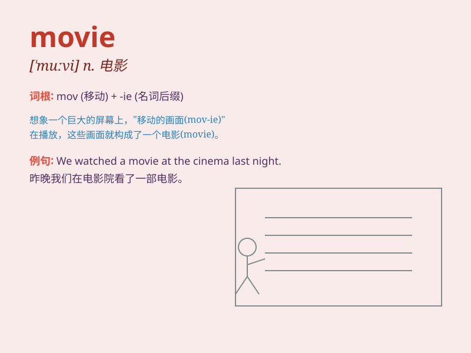

## movie

**英音:** _[\'muːvɪ]_ **美音:** _[\'muvi]_

**译义:** *n.电影*

### 短语

+ **movie star:** _电影明星_

+ **movie theater:** _电影院_

+ **action movie:** _动作片_

+ **comedy movie:** _喜剧片_

+ **science fiction movie:** _科幻片_

### 例句

#### 例句1

> **I watched a great movie last night.**

**中文翻译:** 我昨晚看了一部很棒的电影。

**单词释义:** 电影

#### 例句2

> **This movie is very popular among young people.**

**中文翻译:** 这部电影在年轻人中很受欢迎。

**单词释义:** 电影

#### 例句3

> **She has a passion for making movies.**

**中文翻译:** 她热衷于制作电影。

**单词释义:** 电影

### 背诵小故事

> One day, I was very tired. So I decided to go to a place to relax. I
chose a movie theater. There, I enjoyed a wonderful movie and forgot all
my troubles.

**有一天，我非常累。所以我决定去一个地方放松。我选择了电影院。在那里，我欣赏了一部精彩的电影，忘记了所有的烦恼。**

### 图义

