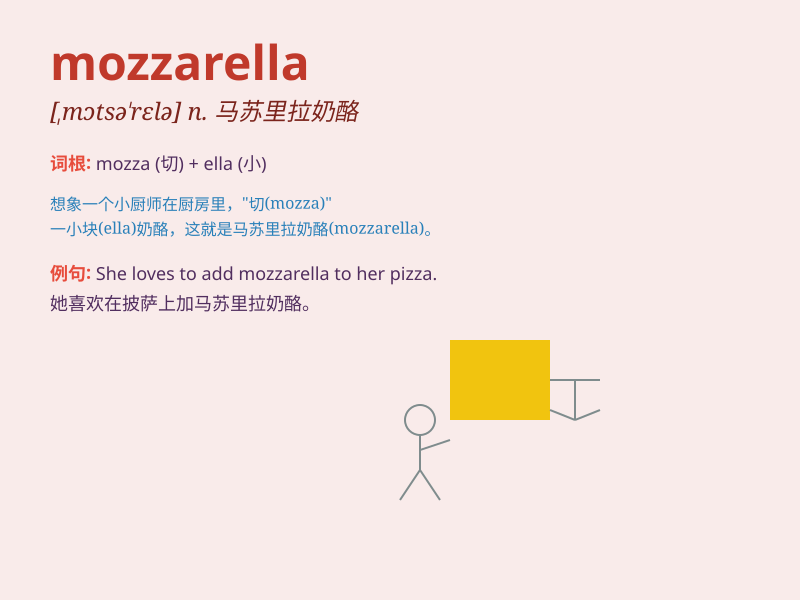

## mozzarella

**英音:** _[ˌmɒtsəˈrelə]_ **美音:** _[ˌmɑːtsəˈrelə]_

**译义:** *n.一种意大利干酪,色白味淡的*

### 短语

+ **mozzarella cheese:** _马苏里拉奶酪_

+ **fresh mozzarella:** _新鲜的马苏里拉奶酪_

+ **mozzarella sticks:** _马苏里拉奶酪棒_

+ **grilled mozzarella:** _烤马苏里拉奶酪_

+ **mozzarella salad:** _马苏里拉奶酪沙拉_

### 例句

#### 例句1

> **I love the taste of mozzarella on my pizza.**

**中文翻译:** 我喜欢披萨上的马苏里拉奶酪的味道。

**单词释义:** 马苏里拉奶酪（一种意大利奶酪）

#### 例句2

> **The chef added some mozzarella to the salad.**

**中文翻译:** 厨师在沙拉里加了一些马苏里拉奶酪。

**单词释义:** 马苏里拉奶酪

#### 例句3

> **She made a sandwich with mozzarella and tomatoes.**

**中文翻译:** 她用马苏里拉奶酪和西红柿做了一个三明治。

**单词释义:** 马苏里拉奶酪

### 背诵小故事

> A mouse was very hungry. It found a big piece of mozzarella cheese.
It was so happy and ate it all. Now you remember mozzarella, the cheese
that made the mouse full.

**一只老鼠非常饿。它发现了一大块马苏里拉奶酪。它非常高兴，把奶酪全吃了。现在你记住mozzarella这个单词，就是让老鼠饱餐的那种奶酪。**

### 图义

