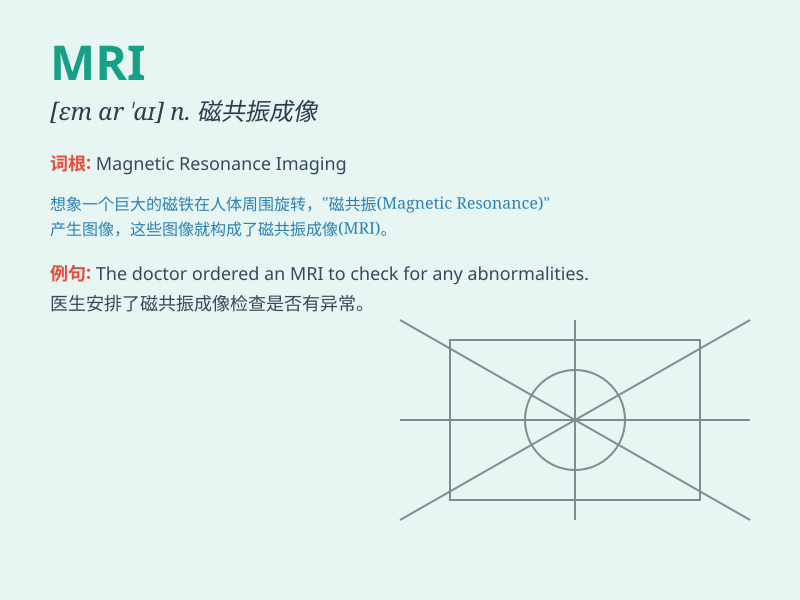

## MRI

**英音:** __ **美音:** __

**译义:** *abbr. 磁共振成像（Magnetic Resonance Imaging）*

### 短语

+ **MRI scan:** _磁共振成像扫描_

+ **MRI machine:** _磁共振成像机器_

+ **MRI test:** _磁共振成像检查_

+ **MRI center:** _磁共振成像中心_

+ **MRI technology:** _磁共振成像技术_

### 例句

#### 例句1

> **The doctor ordered an MRI to examine the patient\'s brain.**

**中文翻译:** 医生安排了一次核磁共振成像来检查病人的大脑。

**单词释义:** 核磁共振成像

#### 例句2

> **The MRI results showed no abnormalities.**

**中文翻译:** 核磁共振成像的结果显示没有异常。

**单词释义:** 核磁共振成像

#### 例句3

> **She was nervous before the MRI scan.**

**中文翻译:** 在做核磁共振扫描之前她很紧张。

**单词释义:** 核磁共振成像

### 背诵小故事

> A doctor was very puzzled by a patient\'s condition. Then he
remembered to use MRI to scan the patient\'s body and finally found the
problem. MRI is like a magic eye that can see inside our bodies.

**一位医生对一位病人的病情感到非常困惑。然后他想起使用 MRI
来扫描病人的身体，最终找到了问题。MRI
就像一只神奇的眼睛，可以看到我们身体内部。**

### 图义

